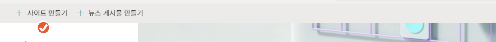
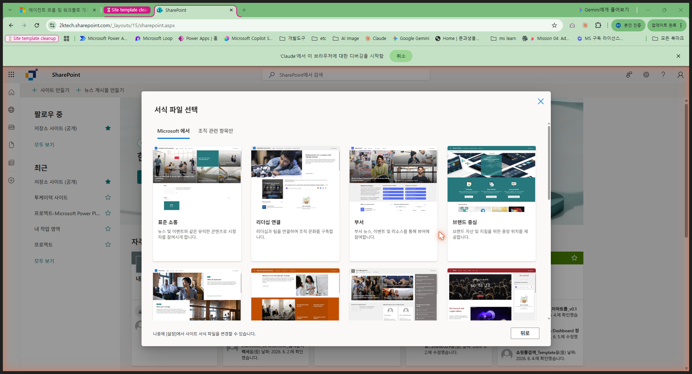
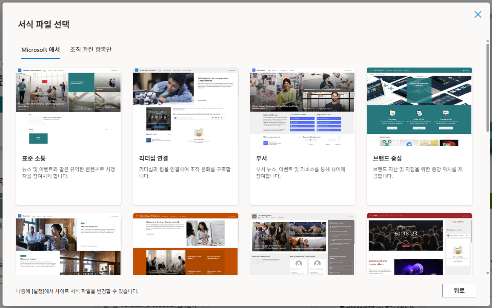
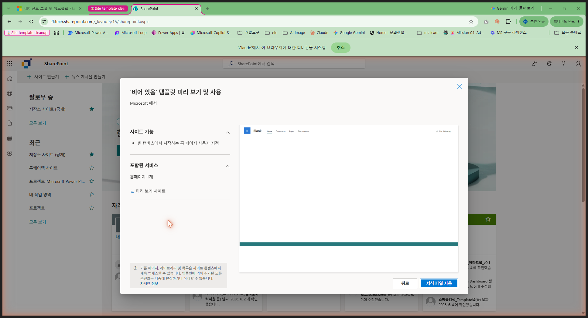
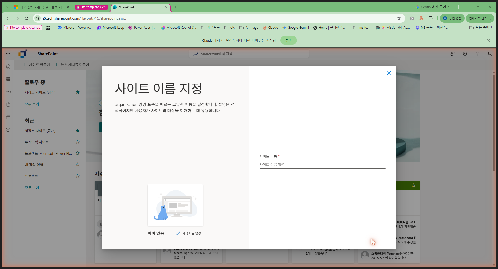
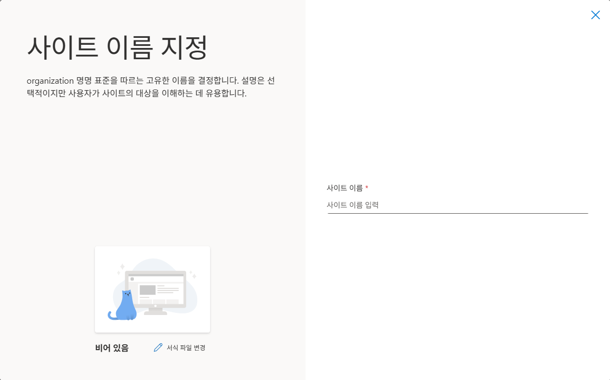
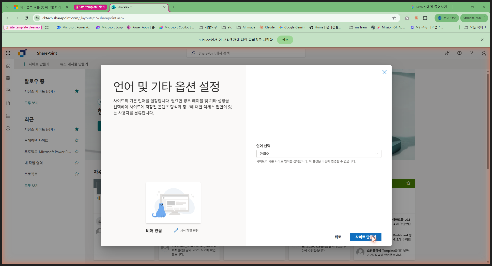
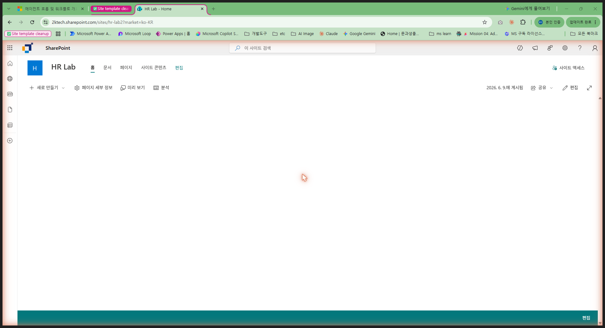
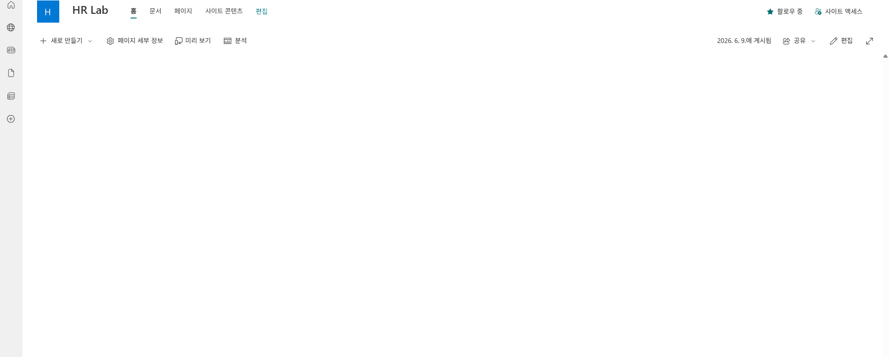

# 0-1. SharePoint 사이트 생성
{: .no_toc }

<details open markdown="block">
  <summary>목차</summary>
  {: .text-delta }
1. TOC
{:toc}
</details>

---

## 🎯 학습 목표

- SharePoint 커뮤니케이션 사이트를 빈 템플릿으로 생성할 수 있다.
- 사이트 이름과 URL을 설정하는 방법을 이해한다.

## ⏱ 예상 소요 시간

{: .time }
약 10분

---

## 준비물

- Microsoft 365 계정 (SharePoint 포함 라이선스)
- **SharePoint 사이트 생성 권한** — 조직 정책에 따라 막혀 있을 수 있습니다.

{: .warning }
SharePoint 홈에서 **`+ 사이트 만들기`** 버튼이 보이지 않으면 사이트 생성 권한이 없는 것입니다. 강의 전에 IT 관리자에게 권한을 요청하거나, 강사가 안내하는 실습 테넌트를 사용하세요.

---

## 개념

이 실습에서 만들 **SharePoint 사이트**는 HR 채용 데이터의 저장 기반이 됩니다.  
지원자 명단은 이 사이트의 **목록(List)**에, 이력서 파일은 **문서 라이브러리**에 저장됩니다.

SharePoint 사이트 유형은 크게 두 가지입니다.

| 유형 | 특징 | 이 실습 |
|---|---|---|
| 팀 사이트 | 팀 협업 중심, Microsoft 365 그룹 자동 생성 | ✕ |
| **커뮤니케이션 사이트** | 포털·정보 공유 중심, 그룹 없이 가볍게 생성 | ✅ |

커뮤니케이션 사이트를 선택하는 이유: 채용 담당자 외에 불필요한 Microsoft 365 그룹이 생성되지 않아 환경을 간결하게 유지할 수 있습니다.

---

## 단계별 가이드

### 1단계. SharePoint 홈 접속

브라우저에서 아래 URL로 접속합니다.

```
https://[테넌트명].sharepoint.com
```

왼쪽 상단 **`+ 사이트 만들기`** 버튼을 클릭합니다.



---

### 2단계. 사이트 유형 — 커뮤니케이션 사이트 선택



오른쪽 **커뮤니케이션 사이트**를 클릭합니다.

---

### 3단계. 서식 파일 — 비어 있음 선택



여러 템플릿이 나타납니다. 목록을 **스크롤 맨 아래**까지 내립니다.



맨 아래에 있는 **비어 있음**을 클릭합니다.

{: .note }
"표준 소통", "부서" 등의 템플릿은 기본 페이지와 웹 파트가 미리 들어있습니다. 실습에서는 가장 간결한 **비어 있음**을 사용합니다.

---

### 4단계. 템플릿 미리보기 확인



"사이트 기능: 빈 캔버스에서 시작하는 홈 페이지 사용자 지정"이 표시됩니다.  
**`서식 파일 사용`** 버튼을 클릭합니다.

---

### 5단계. 사이트 이름 및 URL 입력



아래 값을 입력합니다.

| 항목 | 입력값 |
|---|---|
| 사이트 이름 | `HR Lab` |
| 사이트 주소(URL) | `hr-lab` |
| 사이트 설명 | (선택, 비워도 됩니다) |

{: .note }
사이트 주소는 이름에서 자동으로 제안됩니다(`HRLab`). 소문자·하이픈 형태(`hr-lab`)를 쓰려면 주소 필드를 클릭해 직접 수정하세요 — 어느 쪽이든 실습 진행에는 문제 없습니다.



이름 입력 후 초록색 **"사이트 이름을 사용할 수 있습니다."** 메시지가 표시되면 정상입니다.  
**`다음`** 버튼을 클릭합니다.

{: .warning }
이미 동일 URL의 사이트가 있으면 URL 뒤에 숫자가 붙을 수 있습니다 (`hr-lab2` 등). 이후 실습은 동일하게 진행됩니다.

---

### 6단계. 언어 설정 확인



언어 선택의 기본값은 **영어**입니다. 드롭다운을 열어 **한국어**를 선택합니다.

{: .important }
언어 설정은 사이트 생성 후 변경할 수 없습니다. 반드시 **한국어**로 설정하세요.

**`사이트 만들기`** 버튼을 클릭합니다.

---

### 7단계. 생성 완료 확인

잠시 기다리면 HR Lab 사이트 홈 화면이 나타납니다.



---

## ✅ 체크포인트

- [ ] 브라우저 주소창에 `sharepoint.com/sites/hr-lab`(또는 `hr-lab2`) 형태의 URL이 보입니다.
- [ ] 왼쪽 상단에 **HR Lab** 사이트 이름이 표시됩니다.
- [ ] 본문 영역이 완전히 비어 있는 빈 홈 페이지가 보입니다.

---

## 핵심 정리

- **커뮤니케이션 사이트 + 비어 있음 템플릿**으로 시작합니다.
- 사이트 언어(한국어)는 **생성 후 변경 불가** — 반드시 생성 시 확인.
- 이 사이트가 이후 모든 실습(목록, 문서 라이브러리, 흐름 연결)의 기반이 됩니다.

---

## 👉 다음 단계

사이트 생성이 완료되었습니다. 이제 지원자 데이터를 저장할 **목록(List)을 생성**합니다.

[0-2. 지원자 마스터 List 생성 →](./u0-2-list-create.html)
