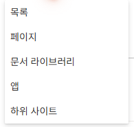
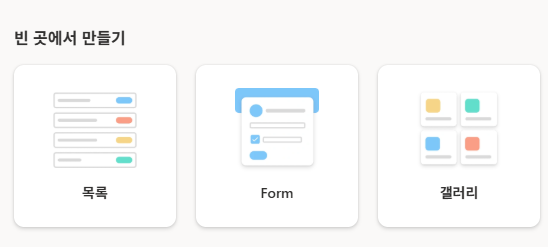
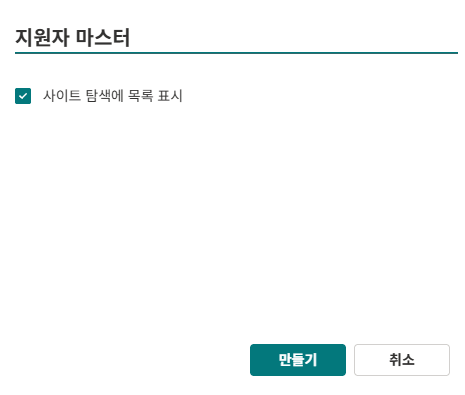
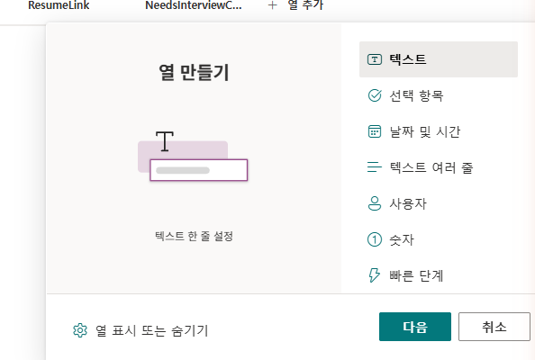
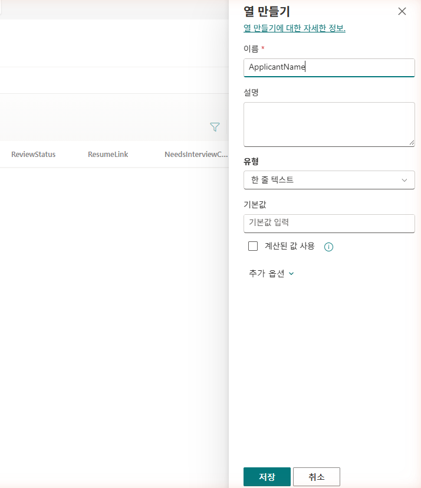
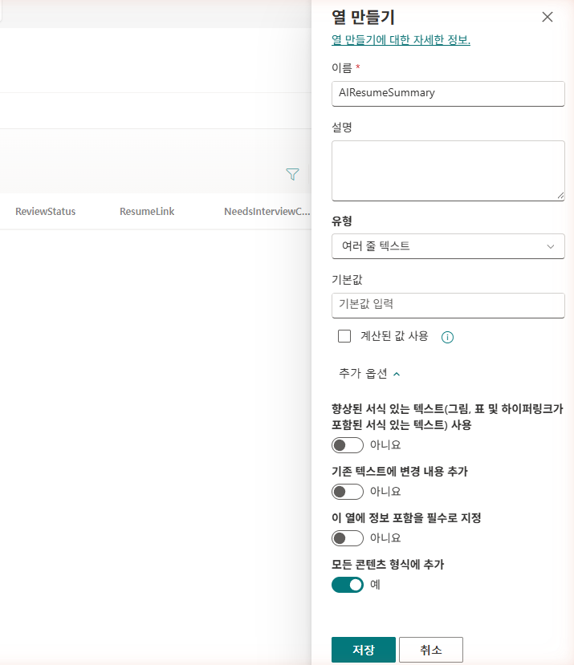
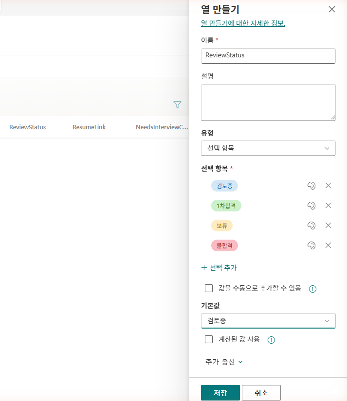
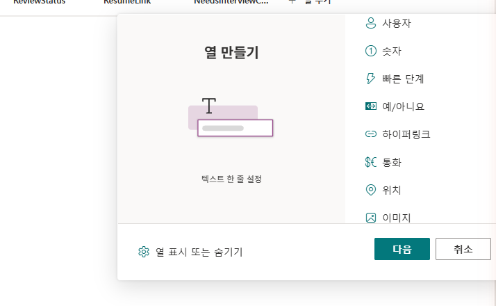
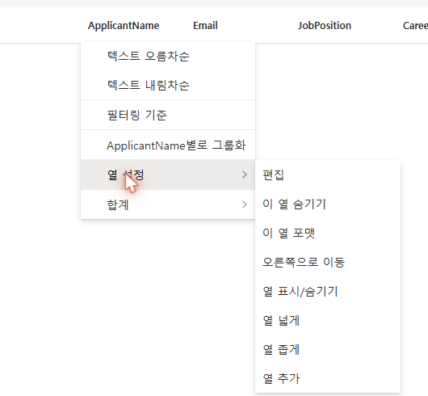
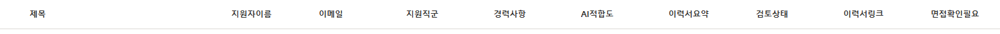

# 0-2. 지원자 마스터 List 생성
{: .no_toc }

<details open markdown="block">
  <summary>목차</summary>
  {: .text-delta }
1. TOC
{:toc}
</details>

---

## 🎯 학습 목표

- HR Lab 사이트에 지원자 데이터를 담을 **목록(List)**을 만들 수 있다.
- 채용 워크플로 전체가 사용할 **필수 컬럼 스키마**를 설계할 수 있다.
- 컬럼의 **내부 이름(internal name)**을 영문으로 확보하는 이유와 방법을 이해한다.

## ⏱ 예상 소요 시간

| 구분 | 시간 |
|---|---|
| 강사 설명 | 5분 |
| 실습 | 15분 |
| 버퍼 | 5분 |

---

## 준비물

- 0-1에서 만든 **HR Lab 사이트**
- 해당 사이트의 **소유자(편집) 권한**

---

## 개념

**목록(List)**은 행과 열로 이루어진 SharePoint(이하 SP)의 데이터 저장소입니다. 엑셀 표와 비슷하지만, 흐름(Flow)·에이전트가 프로그래밍 방식으로 읽고 쓸 수 있다는 점이 다릅니다.

이 목록은 채용 솔루션 전체의 **단일 진실 원천(single source of truth)**입니다.

| 누가 | 이 목록을 |
|---|---|
| 적재 흐름 (Unit 1) | **씁니다** — 메일에서 추출한 지원자를 새 항목으로 |
| 승인 흐름 (Unit 2) | **승인 상태를 바꿉니다** |
| 면접관 에이전트 (Unit 3–4) | **읽습니다** — 조회·적합도 평가 |
| 면접 확정 흐름 (Unit 5) | **갱신합니다** — 검토상태 트랜잭션 |

그래서 **여기서 정하는 컬럼 하나하나가 이후 모든 유닛의 인터페이스**가 됩니다. 컬럼 이름을 잘못 잡으면 뒤에서 흐름·식이 줄줄이 어긋나므로, 스키마 설계가 이 유닛의 핵심입니다.

{: .important }
**내부 이름(internal name)은 컬럼을 처음 만든 이름으로 고정됩니다.** 한글 이름으로 만들면 내부 이름이 `_x...` 형태로 인코딩되어, 흐름의 OData 필터·식에서 다루기가 매우 까다로워집니다. 그래서 이 실습은 **컬럼을 영문 이름으로 먼저 만든 뒤, 표시 이름만 한글로 바꾸는** 순서로 진행합니다. 그러면 내부 이름은 깔끔한 영문(`ApplicantName` 등)으로 유지됩니다.

---

## 단계별 가이드

### 1단계. 새 목록 만들기

HR Lab 사이트의 **사이트 콘텐츠** 화면에서 좌측 상단 **`+ 새로 만들기`** → **`목록`**을 클릭합니다.

<!-- SCREENSHOT: u0-s10 — 사이트 콘텐츠 +새로 만들기 메뉴에서 '목록' 선택 -->


**어떻게 시작하시겠습니까?** 대화상자가 열립니다. **빈 곳에서 만들기**의 **`목록`** 카드를 선택합니다.

<!-- SCREENSHOT: u0-s11 — 목록 만들기 대화상자, '빈 곳에서 만들기'의 목록 카드 -->


{: .note }
"Excel", "CSV", "기존 목록" 등 데이터를 가져와 시작하는 옵션도 있지만, 컬럼을 처음부터 직접 설계하기 위해 **빈 곳에서 만들기 → 목록**으로 시작합니다.

---

### 2단계. 목록 이름 입력

아래 값을 입력하고 **`만들기`**를 클릭합니다.

| 항목 | 입력값 |
|---|---|
| 이름 | `지원자 마스터` |
| 설명 | (선택, 비워도 됩니다) |

<!-- SCREENSHOT: u0-s12 — 목록 이름 '지원자 마스터' 입력 화면 -->


잠시 기다리면 **제목(Title)** 컬럼 하나만 있는 빈 목록이 생성됩니다.

{: .note }
기본 **제목(Title)** 컬럼은 지우지 않고 그대로 둡니다. 적재 흐름(Unit 1)이 이 컬럼을 `[날짜]지원자이름_직군` 형태의 식별 라벨로 자동 채웁니다.

---

### 3단계. 컬럼 설계 한눈에

이제 아래 9개 컬럼을 추가합니다. **내부 이름(영문)으로 먼저 만들고**, 마지막 단계에서 표시 이름을 한글로 바꿉니다.

| 표시 이름(한글) | 내부 이름(영문, 생성 시) | 형식 | 채우는 주체 |
|---|---|---|---|
| 지원자이름 | `ApplicantName` | 한 줄 텍스트 | 적재 흐름 |
| 이메일 | `Email` | 한 줄 텍스트 | 적재 흐름 |
| 지원직군 | `JobPosition` | 한 줄 텍스트 | 적재 흐름 |
| 경력사항 | `CareerLevel` | 한 줄 텍스트 | 적재 흐름 |
| 이력서요약 | `AIResumeSummary` | 여러 줄 텍스트 (일반) | 적재 흐름(AI) |
| 이력서링크 | `ResumeLink` | 하이퍼링크 | 적재 흐름 |
| 검토상태 | `ReviewStatus` | 선택 | 면접 확정 흐름 |
| AI적합도 | `AIFitLevel` | 한 줄 텍스트 | 에이전트/흐름 |
| 면접확인필요 | `NeedsInterviewConfirm` | 예/아니요 | 에이전트/흐름 |

{: .warning }
**승인상태**는 이 표에 없습니다. 직접 만드는 컬럼이 아니라 SharePoint **내장 콘텐츠 승인** 기능이며, 다음 서브유닛(0-3)에서 활성화합니다. 지금 텍스트 컬럼으로 만들지 마세요.

{: .note }
`AIFitLevel`, `NeedsInterviewConfirm`의 형식은 운영 정책에 따라 선택(Choice)이나 다른 형식으로 바꿀 수 있습니다. 이 실습에서는 가장 단순한 형식으로 만든 뒤 필요 시 조정합니다.

---

### 4단계. 텍스트 컬럼 추가 (영문 이름으로)

목록 오른쪽 끝 **`+ 열 추가`**를 클릭하고 형식으로 **`한 줄 텍스트`**를 선택합니다.

<!-- SCREENSHOT: u0-s13 — +열 추가 → 형식 선택 패널 (한 줄 텍스트) -->


**이름** 칸에 영문 내부 이름을 그대로 입력합니다(예: `ApplicantName`).

<!-- SCREENSHOT: u0-s14 — 열 만들기 패널, 이름에 ApplicantName 입력 -->


같은 방법으로 **`Email`, `JobPosition`, `CareerLevel`, `AIFitLevel`** 도 각각 **한 줄 텍스트**로 추가합니다.

{: .note }
지금은 영문 이름으로 만드는 것이 목적입니다. 한글 표시 이름은 8단계에서 한꺼번에 바꿉니다.

---

### 5단계. 이력서요약 — 여러 줄 텍스트(일반)

`+ 열 추가` → **`여러 줄 텍스트`** → 이름 `AIResumeSummary` 를 입력합니다.

열 옵션에서 **서식 있는 텍스트(Rich text)를 끄고 일반 텍스트(Plain text)로** 설정합니다.

<!-- SCREENSHOT: u0-s15 — 여러 줄 텍스트, 서식있는 텍스트 OFF -->


{: .important }
**반드시 일반 텍스트로 만드세요.** 서식 있는 텍스트로 두면 AI가 생성한 요약이 `<div class="ExternalClass...">` 같은 HTML 래퍼 태그와 함께 저장되어, 승인 카드와 챗봇 응답에서 태그가 그대로 노출됩니다(Unit 2에서 실제로 겪는 함정입니다).

---

### 6단계. 검토상태 — 선택(Choice) 컬럼

`+ 열 추가` → **`선택`** → 이름 `ReviewStatus`. 선택 항목에 아래 4개를 입력합니다.

```
검토중
1차합격
보류
불합격
```

**기본값**은 `검토중`으로 설정합니다.

<!-- SCREENSHOT: u0-s16 — 선택 컬럼 ReviewStatus, 4개 선택지 + 기본값 검토중 -->


{: .note }
검토상태는 면접 확정 흐름(Unit 5)이 대화형으로 바꾸는 값입니다. 기본값 `검토중`으로 시작해 사람이 면접 결과에 따라 전이시킵니다.

---

### 7단계. 이력서링크 · 면접확인필요 추가

- `+ 열 추가` → **`하이퍼링크`** → 이름 `ResumeLink`
- `+ 열 추가` → **`예/아니요`** → 이름 `NeedsInterviewConfirm` (기본값 `아니요`)

<!-- SCREENSHOT: u0-s17 — 하이퍼링크/예아니요 컬럼 추가 -->


---

### 8단계. 표시 이름을 한글로 변경

이제 영문으로 만든 컬럼들의 **표시 이름만** 한글로 바꿉니다. 각 컬럼 머리글을 클릭 → **`열 설정`** → **`편집`**을 선택하면 열 편집 패널이 열립니다. **이름** 칸을 3단계 표의 한글 이름으로 바꾸고 저장합니다.

<!-- SCREENSHOT: u0-s18 — 열 머리글 메뉴 → 열 설정 → 편집 -->


9개 컬럼의 표시 이름을 모두 한글로 바꾸면 목록 머리글이 아래처럼 **제목 + 9개 한글 컬럼**으로 보입니다.

<!-- SCREENSHOT: u0-s18b — 한글화 완료된 목록 머리글 (제목 + 9개 한글 컬럼) -->


{: .important }
**표시 이름을 바꿔도 내부 이름은 영문 그대로 유지됩니다.** 화면에는 `지원자이름`으로 보이지만 흐름·식은 여전히 `ApplicantName`으로 참조합니다. 이것이 우리가 영문으로 먼저 만든 이유입니다.

---

## ✅ 체크포인트

- [ ] **지원자 마스터** 목록이 HR Lab 사이트에 생성되어 있습니다.
- [ ] 제목(Title) + 9개 컬럼이 모두 보입니다.
- [ ] 화면의 컬럼 이름은 한글이지만, 열 설정에서 내부 이름이 영문(`ApplicantName` 등)인 것을 확인했습니다.
- [ ] 이력서요약이 **일반 텍스트**, 검토상태가 **선택(기본값 검토중)** 으로 설정되어 있습니다.
- [ ] 승인상태 컬럼은 **만들지 않았습니다**(다음 서브유닛에서 콘텐츠 승인으로 처리).

---

## 핵심 정리

| 항목 | 내용 |
|---|---|
| 단일 진실 원천 | 이 목록 하나를 흐름·에이전트가 함께 읽고 씁니다. |
| 내부 이름 영문화 | 영문으로 먼저 만들고 표시 이름만 한글로 → 흐름의 OData 필터가 깔끔해집니다. |
| 이력서요약 = 일반 텍스트 | 서식 있는 텍스트는 HTML 태그 누출의 원인. |
| 승인상태 ≠ 컬럼 | 내장 콘텐츠 승인 기능(다음 서브유닛). |

---

## 👉 다음 단계

목록과 컬럼이 준비됐습니다. 이제 이력서 원본 PDF를 보관할 **문서 라이브러리**를 만들고 **콘텐츠 승인**을 켭니다.

[0-3. 문서 라이브러리 + 콘텐츠 승인 →](./u0-3-library-approval.html)
