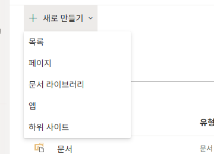
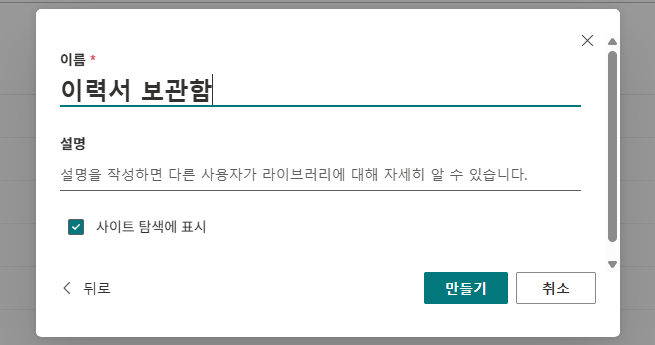
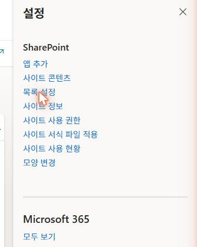
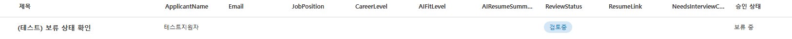

# 0-3. 문서 라이브러리 + 콘텐츠 승인
{: .no_toc }

  
목차

  {: .text-delta }
1. TOC
{:toc}

---

## 🎯 학습 목표

- 이력서 원본 PDF를 보관할 **문서 라이브러리**를 만들 수 있다.
- 지원자 마스터 목록에 **콘텐츠 승인**을 활성화해, 사람의 승인 전까지 항목이 공개되지 않는 구조를 만든다.
- **승인상태**가 직접 만든 컬럼이 아니라 SharePoint(이하 SP) 내장 기능임을 이해한다.

## ⏱ 예상 소요 시간

{: .time }
약 17분

---

## 준비물

- 0-2에서 만든 **지원자 마스터** 목록
- 해당 사이트의 **소유자(편집) 권한**

---

## 개념

이 서브유닛에서는 두 가지를 구성합니다. 성격이 다른 두 저장소와, 그 위에 적용되는 **사람의 승인 장치**입니다.

### 목록 vs 문서 라이브러리

| | 목록(List) | 문서 라이브러리(Library) |
|---|---|---|
| 담는 것 | 데이터 행 (지원자 레코드) | 파일 (이력서 PDF) |
| 이 실습 | 지원자 마스터 (0-2) | **이력서 보관함 (지금)** |

이력서 원본은 파일이라 라이브러리에 보관합니다. 적재 흐름(Unit 1)이 메일 첨부 PDF를 이 라이브러리에 저장하고, 그 경로를 목록의 `ResumeLink` 컬럼에 적습니다.

{: .note }
이력서 원본은 에이전트의 Knowledge에 등록하지 않습니다. "기준"이 아니라 "대상 데이터"이기 때문입니다. 필요할 때 `ResumeLink`로 해당 1건만 가져옵니다(Unit 4의 면접 질문 생성). 지금은 "원본은 라이브러리에 보관한다"는 점만 기억하면 됩니다.

### 콘텐츠 승인 = 사람의 승인 장치

**콘텐츠 승인**은 SP에 내장된 기능입니다. 활성화하면 새로 만들어진 항목이 곧바로 공개되지 않고 **보류 중** 상태로 시작합니다. 승인자가 검토해 **승인됨**으로 바꿔야 비로소 일반 조회에 나타납니다.

{: .important }
이때 생기는 **승인상태**는 우리가 0-2에서 만든 컬럼이 아닙니다. 콘텐츠 승인을 켜는 순간 SP가 자동으로 부여하는 내장 상태(`OData__ModerationStatus`)입니다. 그래서 0-2의 컬럼 표에 승인상태가 없었던 것입니다. 이 "사람이 승인해야 공개된다"는 구조가 **Unit 2 승인 흐름(비동기 HITL)**과 **Unit 4 조회**의 토대가 됩니다.

---

## 단계별 가이드

### 1단계. 이력서 보관함 만들기

사이트 콘텐츠에서 **`+ 새로 만들기`** → **`문서 라이브러리`**를 클릭합니다.

<!-- SCREENSHOT: u0-s19 — 새로 만들기 메뉴에서 '문서 라이브러리' 선택 -->

**`빈 라이브러리`**를 선택하고 이름을 입력합니다.

| 항목 | 입력값 |
|---|---|
| 이름 | `이력서 보관함` |
| 설명 | (선택) |

<!-- SCREENSHOT: u0-s20 — 문서 라이브러리 이름 '이력서 보관함' 입력 -->

**`만들기`**를 클릭하면 빈 라이브러리가 생성됩니다.

{: .note }
지금은 비어 있어도 됩니다. 실제 이력서 PDF는 Unit 1의 적재 흐름이 메일에서 받아 자동으로 채웁니다.

---

### 2단계. 지원자 마스터 목록 설정 열기

이제 콘텐츠 승인은 **목록(지원자 마스터)** 쪽에 켭니다. 지원자 마스터 목록을 열고, 오른쪽 위 **설정(⚙)** → **`목록 설정`**으로 들어갑니다.

<!-- SCREENSHOT: u0-s21 — 설정 톱니바퀴 → 목록 설정 메뉴 -->

{: .warning }
콘텐츠 승인은 **이력서 보관함이 아니라 지원자 마스터 목록**에 켭니다. 승인 대상은 파일이 아니라 "지원자 레코드(특히 AI 요약 품질)"이기 때문입니다.

---

### 3단계. 콘텐츠 승인 켜기

목록 설정에서 **`버전 관리 설정`**을 클릭합니다. 첫 항목 **"이 목록에 제출된 항목에 대해 콘텐츠 승인이 필요합니까?"**에서 **`예`**를 선택하고 **`확인`**을 누릅니다.

<!-- SCREENSHOT: u0-s22 — 버전 관리 설정, 콘텐츠 승인 '예' 선택 -->

---

### 4단계. 보류 중 상태 확인

목록으로 돌아와 테스트로 항목을 하나 추가해 봅니다. **승인 상태** 열에 **보류 중**으로 표시되면 정상입니다.

<!-- SCREENSHOT: u0-s23 — 새 항목의 승인 상태 '보류 중' 표시 -->

{: .note }
콘텐츠 승인이 활성화된 목록은 항목을 **수정할 때마다** 승인 상태가 다시 **보류 중**으로 초기화됩니다. 이 동작은 지침으로 막을 수 없는 SP의 서버 부작용으로, Unit 5에서 "왜 상태 변경은 흐름이어야 하는가"의 핵심 근거가 됩니다. 지금은 "수정하면 다시 승인이 필요해진다"는 점만 기억해 두면 됩니다.

---

## ✅ 체크포인트

- [ ] **이력서 보관함** 문서 라이브러리가 사이트에 생성되어 있습니다.
- [ ] 지원자 마스터 목록의 버전 관리 설정에서 **콘텐츠 승인 = 예**로 되어 있습니다.
- [ ] 새로 추가한 항목의 **승인 상태**가 **보류 중**으로 표시됩니다.
- [ ] 승인상태는 직접 만든 컬럼이 아니라 **내장 기능**임을 이해했습니다.

---

## 핵심 정리

| 항목 | 내용 |
|---|---|
| 문서 라이브러리 | 이력서 원본(파일) 보관. 적재 흐름이 채우고 `ResumeLink`가 가리킴. |
| 콘텐츠 승인 | SP 내장 기능. 켜면 `OData__ModerationStatus`(승인상태)가 자동 생성 — 직접 만든 컬럼 아님. |
| 보류 중 → 승인됨 | 사람이 승인해야 공개되는 구조 = 비동기 HITL의 토대 (Unit 2). |
| moderation 리셋 | 항목 수정 시 승인 상태가 보류 중으로 되돌아감 = 흐름이 필요한 이유의 복선 (Unit 5). |

---

## 👉 다음 단계

사이트·목록·이력서 보관함·콘텐츠 승인까지 SharePoint 환경이 완성되었습니다. 마지막으로 흐름과 에이전트를 담을 **솔루션**과 **환경 변수**를 등록합니다.

[0-4. 솔루션 생성 + 환경 변수 등록 →](./u0-4-solution-envvar.html)
