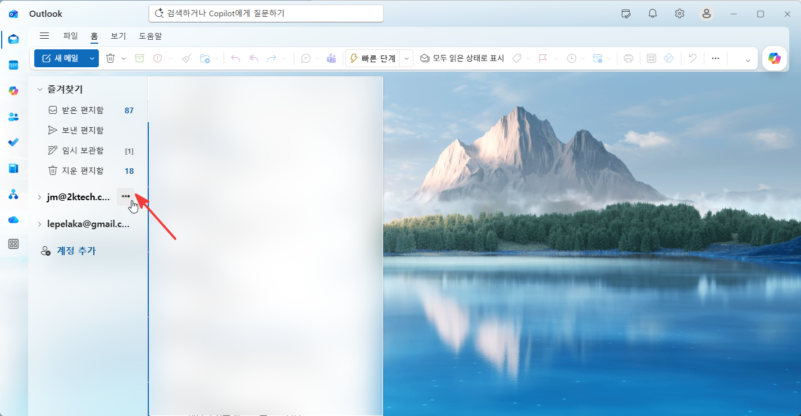
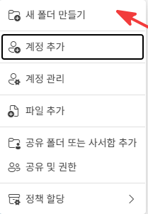
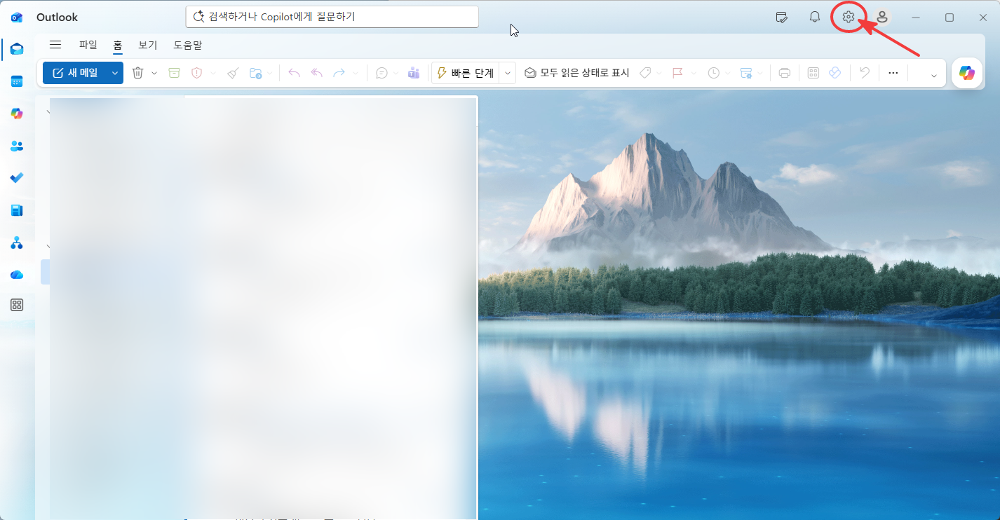
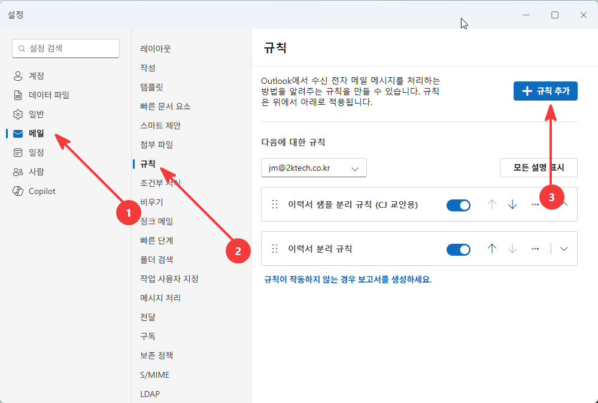
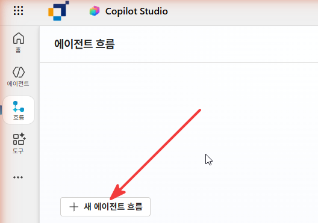
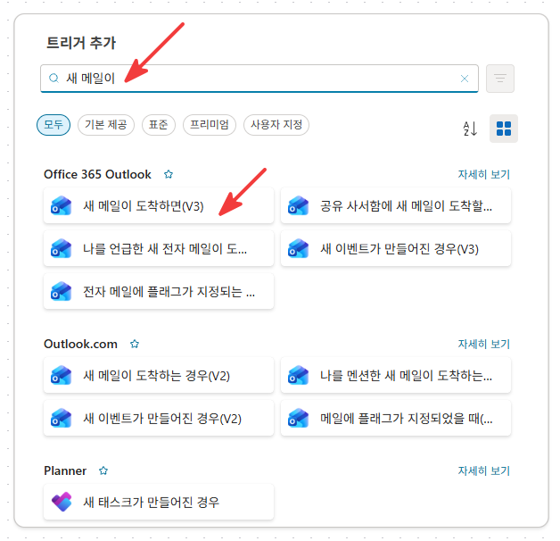
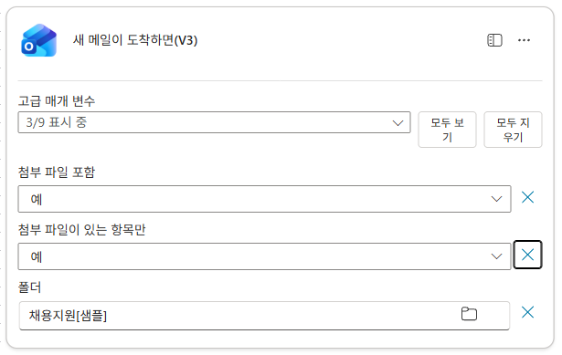

# 1-1. 흐름 만들기 + 메일 수신 트리거
{: .no_toc }

  
목차

  {: .text-delta }
1. TOC
{:toc}

---

## 🎯 학습 목표

- **이벤트 기반 자동화**가 무엇인지, 트리거가 흐름의 출발점인 이유를 이해한다.
- 메일이 도착하면 자동 실행되는 흐름의 **트리거를 설정**할 수 있다.
- 첨부 파일이 있는 메일만 처리하도록 **트리거 조건**을 줄 수 있다.

## ⏱ 예상 소요 시간

{: .time }
약 12분

---

## 준비물

- Unit 0에서 만든 **지원자 마스터** 목록과 **이력서 보관함**(문서 라이브러리)
- **Outlook(메일)·SharePoint 커넥터** 사용 권한
- 흐름을 만들 **Copilot Studio(이하 CS) 환경** 접근

---

## 개념

이 유닛에서 만드는 **적재 흐름**은 "이력서가 첨부된 메일이 오면 → 자동으로 지원자 데이터로 만든다"는 자동화입니다. 사람이 버튼을 누르는 게 아니라 **메일 도착이라는 사건(event)** 이 흐름을 깨웁니다. 이런 출발점을 **트리거(trigger)** 라고 합니다.

{: .note }
**왜 Power Automate가 아니라 CS에서 만드나요?** 이 흐름은 Power Automate 포털이 아니라 **Copilot Studio 안에서** 만듭니다. 같은 흐름 엔진을 쓰지만, 나중에 면접관 에이전트가 이 흐름들과 한 환경에서 맞물리도록 처음부터 CS에서 관리합니다.

| 구성 요소 | 역할 |
|---|---|
| 트리거 | 흐름을 시작시키는 사건 — 여기서는 "전용 폴더에 새 메일 도착" |
| 액션 | 트리거 이후 순서대로 실행되는 단계들 (다음 서브유닛부터) |

### 범위 좁히기 — 받은 편지함 전체는 트리거로 잡지 않는다

받은 편지함 **전체**를 트리거로 걸면, 업무 메일·뉴스레터·첨부 있는 아무 메일에까지 흐름이 깨어납니다. 그러면 **AI 프롬프트가 매번 실행돼 크레딧을 태우고**, 이력서가 아닌 첨부를 추출해 **목록에 쓰레기 데이터가 쌓입니다.** 데모 중 엉뚱한 메일 한 통에도 흐름이 튑니다.

그래서 트리거가 감시하는 범위를 **지원 메일만 모이는 전용 폴더**로 좁힙니다. 분류 자체는 흐름이 아니라 **Outlook 받은 편지함 규칙**이 합니다.

| 단계 | 누가 | 무엇을 |
|---|---|---|
| 1. 분류 | Outlook 규칙 | 제목에 `[이력서샘플]` 등이 있는 메일을 **채용 전용 폴더로 이동** |
| 2. 감지 | 적재 흐름 트리거 | **그 폴더에만** 새 메일이 오면 실행 |

{: .note }
이 방식의 장점은 흐름이 단순해진다는 것입니다. "이 메일이 지원 메일인가?"를 흐름 안에서 판단하지 않고, 폴더에 들어온 것은 **이미 지원 메일**이라고 신뢰합니다. 판단 책임을 메일 규칙(상류)으로 올린 셈입니다.

---

## 단계별 가이드

### 1단계. Outlook — 채용 전용 폴더 만들기

Outlook에서 받은 편지함 아래 **채용 전용 폴더**를 먼저 만듭니다. 폴더 목록 하단의 **`+ 새 폴더`** 를 클릭하고 이름을 `채용지원[샘플]`로 입력합니다.

<!-- SCREENSHOT: u1-1-s01 — Outlook 홈, 폴더 목록에서 새 폴더 만들기 진입 -->

<!-- SCREENSHOT: u1-1-s02 — 새 폴더 만들기 메뉴 -->

<!-- SCREENSHOT: u1-1-s03 — 채용지원[샘플] 폴더 생성 완료 후 폴더 목록 -->
![채용지원[샘플] 폴더 생성 완료](../../assets/unit1/u1-1-s03.png)

{: .note }
폴더 이름은 자유롭게 정합니다. 다음 단계에서 Outlook 규칙과 흐름 트리거에 **같은 폴더 이름**을 써야 연결됩니다.

### 2단계. Outlook — 메일 분리 규칙 만들기

폴더가 준비됐으면 **규칙**을 만들어 지원 메일을 자동으로 분류합니다. Outlook 설정(⚙️) → **메일 → 규칙 → `+ 규칙 추가`** 로 들어갑니다.

<!-- SCREENSHOT: u1-1-s04 — Outlook 설정 아이콘으로 이동 -->

<!-- SCREENSHOT: u1-1-s05 — 설정 > 메일 > 규칙 목록 + 규칙 추가 버튼 -->

규칙 생성 화면에서 아래와 같이 설정합니다.

| 항목 | 설정 |
|---|---|
| 규칙 이름 | `이력서 샘플 분리 규칙` (식별용) |
| 조건 | **제목에 포함** → `[이력서샘플]` |
| 작업 | **이동 위치** → `채용지원[샘플]` |

<!-- SCREENSHOT: u1-1-s06 — 규칙 조건(제목 포함·[이력서샘플])·작업(이동·채용지원[샘플]) 설정 -->
![규칙 조건·작업 설정 — 이력서샘플 제목 → 채용지원[샘플] 이동](../../assets/unit1/u1-1-s06.png)

{: .note }
제목 키워드는 샘플 메일 발송 시 제목에 포함할 문구입니다. 실제 운영에서는 조직 규칙에 맞게 바꿉니다(예: `[채용지원]`, `[이력서]`).

### 3단계. CS — 새 에이전트 흐름 만들기

이제 CS로 전환합니다. 좌측 메뉴에서 **흐름** → **`+ 새 에이전트 흐름`** 으로 빈 흐름을 만듭니다. **이름은 이 단계에서 지정하지 않고**, 트리거 설정 후 저장할 때 붙입니다.

<!-- SCREENSHOT: u1-1-s07 — CS 흐름 메뉴에서 새 에이전트 흐름 클릭 -->

{: .note }
이름은 자유지만, 이후 유닛에서 **적재 흐름 / 승인 흐름 / 면접 확정 흐름** 세 개를 구분해 부르게 됩니다. 저장 시 역할이 드러나는 이름을 권합니다.

### 4단계. 트리거 — "새 메일이 도착하면(V3)" 선택

트리거 검색창에 `새 메일이`를 입력하고 **Office 365 Outlook**의 **`새 메일이 도착하면 (V3)`** 트리거를 선택합니다.

<!-- SCREENSHOT: u1-1-s08 — 트리거 추가 화면, '새 메일이 도착하면(V3)' 선택 -->

### 5단계. 트리거 옵션 설정 후 저장 + 이름 지정

트리거의 고급 매개 변수를 펼쳐 아래와 같이 설정합니다.

| 옵션 | 값 |
|---|---|
| 폴더 | `채용지원[샘플]` (1단계에서 만든 전용 폴더) |
| 첨부 파일 포함 | `예` |
| 첨부 파일이 있는 항목만 | `예` |

설정이 끝나면 흐름을 **저장**합니다. 저장 시 이름 입력 창이 나타나면 **`적재 흐름`** 을 입력합니다.

<!-- SCREENSHOT: u1-1-s09 — 트리거 설정 완료 (폴더=채용지원[샘플], 첨부 포함·첨부 있는 항목만=예) -->

{: .important }
**폴더 = 채용 전용 폴더**로 지정해야 받은 편지함의 일반 업무 메일이 흐름을 깨우지 않습니다. 이 폴더에 메일을 넣는 일은 2단계에서 만든 Outlook 규칙이 담당합니다.

{: .important }
**첨부 파일 포함 = 예**로 두어야 다음 단계(AI 추출)에서 첨부 PDF의 내용을 읽을 수 있습니다. 꺼져 있으면 메일 본문만 들어오고 첨부는 비어 있습니다.

{: .note }
전용 폴더로 1차 분류하더라도, 폴더에 비-PDF 첨부가 섞여 들어올 수 있으므로 다음 서브유닛에서 PDF 여부를 한 번 더 거릅니다. **"폴더로 좁히고, 폴더로 못 거르는 건 다음 단계에서"** 가 원칙입니다.

---

## ✅ 체크포인트

- [ ] Outlook에 **채용지원[샘플] 폴더**가 생성돼 있습니다.
- [ ] **Outlook 규칙**이 `[이력서샘플]` 제목의 메일을 채용 전용 폴더로 분리하고 있습니다.
- [ ] CS에 **적재 흐름**이 생성되어 있습니다.
- [ ] 트리거가 **새 메일이 도착하면 (V3)** 로 설정되어 있습니다.
- [ ] 트리거 **폴더가 채용 전용 폴더**로 지정돼 있습니다(받은 편지함 전체가 아님).
- [ ] 첨부 파일 포함 / 첨부 있는 항목만 옵션이 **예**로 켜져 있습니다.

---

## 핵심 정리

| 항목 | 내용 |
|---|---|
| 트리거 | 흐름을 깨우는 사건. 적재 흐름은 "전용 폴더에 새 메일 도착"으로 시작. |
| 전용 폴더 + 규칙 | Outlook 폴더를 먼저 만들고, 규칙으로 지원 메일을 자동 분류. 이 두 가지가 먼저 준비돼야 흐름 트리거가 올바른 범위를 감시한다. |
| 범위 좁히기 | 받은 편지함 전체 ❌ → Outlook 규칙으로 전용 폴더 분리 → 그 폴더만 감시. 크레딧·쓰레기 데이터 방지. |
| 이름 지정 타이밍 | 흐름 이름은 생성 즉시가 아니라 **트리거 설정 완료 후 저장 시** 붙인다. |
| 첨부 포함 | 켜야 AI가 이력서 PDF를 읽을 수 있다. |
| 흐름 관리 주체 | Power Automate 포털이 아니라 CS 안에서 만들고 관리한다. |

---

## 👉 다음 단계

트리거가 메일을 받아오면, 이제 첨부된 이력서에서 정보를 뽑아낼 차례입니다.

[1-2. AI 프롬프트로 이력서 구조화 추출 →](./u1-2-ai-extract.html)
