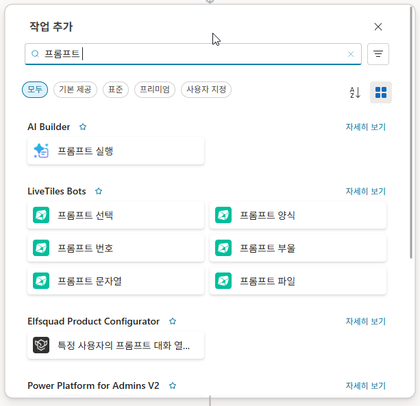
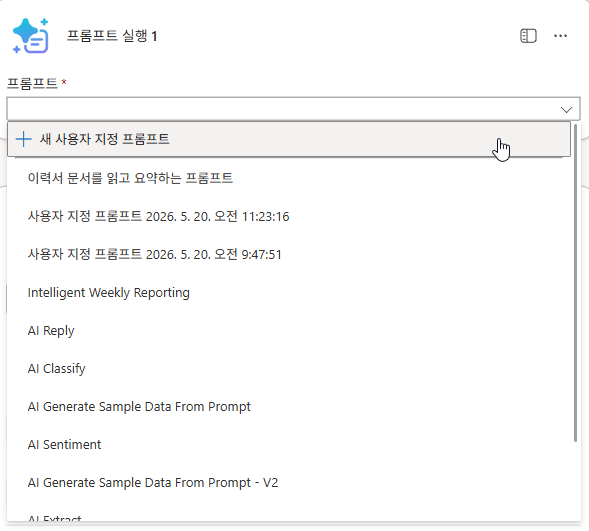
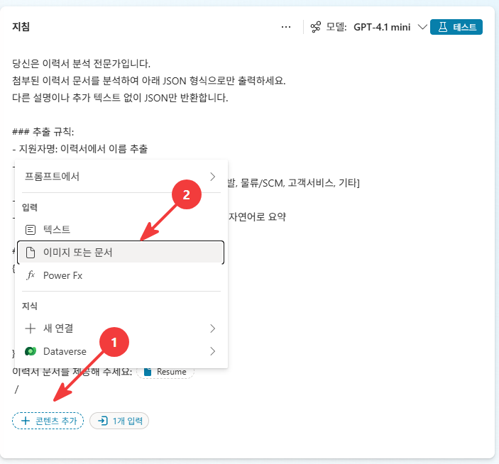
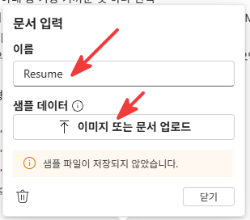
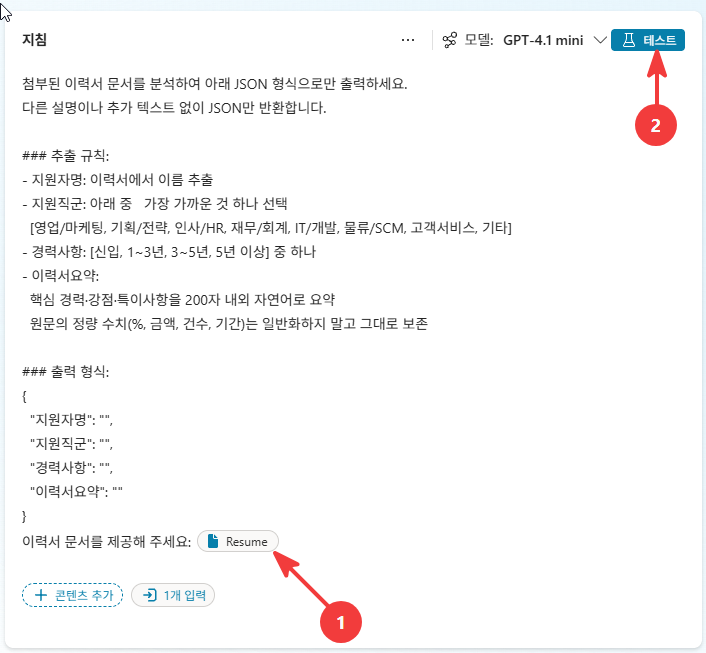

# 1-2. AI 프롬프트로 이력서 구조화 추출
{: .no_toc }

<details open markdown="block">
  <summary>목차</summary>
  {: .text-delta }
1. TOC
{:toc}
</details>

---

## 🎯 학습 목표

- **AI 프롬프트 액션**으로 비정형 이력서(PDF)에서 정형 필드를 추출할 수 있다.
- 첨부파일 배열을 AI 프롬프트 입력에 연결하면 **반복(Apply to each)이 자동 생성**되는 방식을 이해한다.
- AI의 **구조화 출력(JSON)** 을 흐름의 다음 단계에서 쓸 수 있게 받는다.

## ⏱ 예상 소요 시간

{: .time }
약 16분

---

## 준비물

- 1-1에서 만든 **적재 흐름**(트리거까지 완료)
- **AI Builder / AI 프롬프트** 사용 권한 (크레딧 소비)

---

## 개념

이력서는 사람이 자유롭게 쓴 **비정형 문서**입니다. 이걸 목록의 컬럼(지원자이름·직군·경력…)에 넣으려면 **정형 데이터로 변환**해야 합니다. 이 변환을 규칙 기반 파싱이 아니라 **AI 프롬프트**가 합니다 — "이 이력서에서 이름·이메일·직군·경력을 뽑고, 요약을 써줘"라고 시키는 것입니다.

메일 한 통에는 이력서가 **여러 개**(실습 데이터는 6개) 첨부됩니다. AI 프롬프트 액션에 첨부파일 배열을 입력으로 연결하면, CS가 **자동으로 반복(Apply to each)** 을 생성해 각 PDF마다 추출을 돌립니다 — Apply to each를 먼저 수동으로 만들 필요가 없습니다.

{: .important }
여기서 만드는 **이력서요약**은 단순 요약이 아닙니다. 이후 면접관 에이전트가 적합도를 평가할 때 쓰는 **유일한 근거 텍스트**입니다(Unit 4). 요약 품질이 곧 평가 품질이라서, 다음 유닛(승인 흐름)에서 사람이 이 요약을 검수하게 됩니다.

---

## 단계별 가이드

### 1단계. 작업 추가 — 프롬프트 실행 선택

트리거 다음 **`+ 작업 추가`** 를 클릭하고 검색창에 `프롬프트`를 입력합니다. **AI Builder** 아래의 **`프롬프트 실행`** 을 선택합니다.

<!-- SCREENSHOT: u1-2-s01 — 작업 추가 패널, 프롬프트 검색 → AI Builder 프롬프트 실행 선택 -->


### 2단계. 새 사용자 지정 프롬프트 만들기

프롬프트 드롭다운을 열면 기존 프롬프트 목록이 나옵니다. 상단의 **`+ 새 사용자 지정 프롬프트`** 를 클릭합니다.

<!-- SCREENSHOT: u1-2-s02 — 프롬프트 드롭다운, 새 사용자 지정 프롬프트 클릭 -->


### 3단계. 지침 입력 + 문서 입력 추가

프롬프트 편집 화면이 열립니다. **지침** 영역에 아래 내용을 그대로 붙여 넣습니다. 모델은 **GPT-4.1 mini**를 선택합니다.

```
당신은 이력서 분석 전문가입니다.
첨부된 이력서 문서를 분석하여 아래 JSON 형식으로만 출력하세요.
다른 설명이나 추가 텍스트 없이 JSON만 반환합니다.

### 추출 규칙:
- 지원자명: 이력서에서 이름 추출
- 지원직군: 아래 중 가장 가까운 것 하나 선택
  [영업/마케팅, 기획/전략, 인사/HR, 재무/회계, IT/개발, 물류/SCM, 고객서비스, 기타]
- 경력사항: [신입, 1~3년, 3~5년, 5년 이상] 중 하나
- 이력서요약:
  핵심 경력·강점·특이사항을 200자 내외 자연어로 요약
  원문의 정량 수치(%, 금액, 건수, 기간)는 일반화하지 말고 그대로 보존

### 출력 형식:
{
  "지원자명": "",
  "지원직군": "",
  "경력사항": "",
  "이력서요약": ""
}
```

지침 아래 **`+ 콘텐츠 추가`** → **`이미지 또는 문서`** 를 선택합니다.

<!-- SCREENSHOT: u1-2-s03 — 지침 입력 화면 + 콘텐츠 추가 → 이미지 또는 문서 선택 -->


{: .note }
요약·구조화 추출은 모델이 처리하기 비교적 쉬운 작업입니다. **GPT-4.1 mini**로 충분하고, 더 정밀한 판단이 필요한 적합도 평가(Unit 4)와 모델을 분리해 씁니다.

{: .important }
이력서요약의 **정량 수치 보존** 지시가 핵심입니다. AI가 "ROAS 30% 개선"을 "성과 극대화"처럼 뭉뚱그리는 경향이 있는데, 이 수치가 빠지면 나중에 적합도 평가의 성과 항목 판정이 약해집니다.

### 4단계. 문서 입력 이름 지정

문서 입력 패널이 열리면 **이름**을 `Resume`으로 입력하고 닫습니다. 이 이름이 나중에 흐름에서 첨부 파일을 연결할 때 쓰는 입력 슬롯 이름이 됩니다.

<!-- SCREENSHOT: u1-2-s04 — 문서 입력 패널, 이름=Resume 지정 -->


{: .note }
`Resume` 입력 슬롯에 다음 서브유닛에서 **첨부 파일 콘텐츠(배열)** 를 연결하면, CS가 배열임을 인식하고 **자동으로 Apply to each 반복을 생성**합니다 — Apply to each를 먼저 수동으로 만들 필요가 없습니다.

{: .warning }
이력서는 **PDF 전용**입니다. DOCX·HWP를 그대로 넣으면 AI 프롬프트 액션이 **Bad Request**로 거부합니다.

### 5단계. 테스트 — 샘플 이력서로 응답 확인

지침 영역 하단에 **"이력서 문서를 제공해 주세요 : `Resume`"** 칩이 생성돼 있습니다. 이 칩을 클릭해 샘플 이력서 PDF 한 장을 선택합니다. 이후 상단 **`테스트`** 버튼을 눌러 모델 응답을 확인합니다.

{: .note }
테스트용 샘플 이력서: [📄 01. 김지훈.pdf](../../assets/resume_sample/01.%20%EA%B9%80%EC%A7%80%ED%9B%88.pdf)

<!-- SCREENSHOT: u1-2-s05 — 지침 하단 Resume 칩(①)으로 샘플 이력서 선택 후 테스트 버튼(②) 클릭 -->


{: .note }
테스트 결과가 JSON 형식으로 정상 출력되고, 이력서요약에 정량 수치가 보존됐는지 눈으로 확인합니다. 구조가 맞으면 프롬프트를 저장하고 흐름으로 돌아옵니다.

---

## ✅ 체크포인트

- [ ] **프롬프트 실행** 액션이 추가돼 있습니다.
- [ ] 새 사용자 지정 프롬프트가 만들어지고 지침이 입력돼 있습니다.
- [ ] 모델이 **GPT-4.1 mini**로 설정돼 있습니다.
- [ ] 문서 입력 이름이 **`Resume`** 으로 지정돼 있습니다.
- [ ] 샘플 이력서 PDF로 테스트를 실행해 **JSON 형식 출력**과 **정량 수치 보존**을 확인했습니다.

---

## 핵심 정리

| 항목 | 내용 |
|---|---|
| AI 프롬프트 | 비정형 이력서 → 정형 필드로 변환하는 추출기. |
| 자동 반복 생성 | 배열 입력을 연결하면 Apply to each가 자동 생성 — 수동으로 먼저 만들지 않아도 됨. |
| 모델 선택 | GPT-4.1 mini — 추출·요약은 가벼운 모델로 충분, 적합도 평가와 분리. |
| 이력서요약 | 적합도 평가의 유일한 근거. 정량 수치는 보존. |
| PDF 전용 | DOCX·HWP는 Bad Request. |

---

## 👉 다음 단계

이제 추출한 데이터를 SharePoint에 적재합니다 — 원본 PDF는 보관함에, 정형 필드는 목록 항목으로.

[1-3. SharePoint 적재 — 파일 저장 + 항목 만들기 →](./u1-3-sp-load.html)
