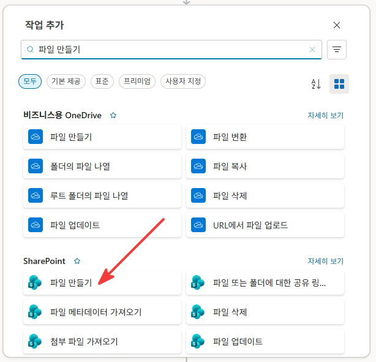
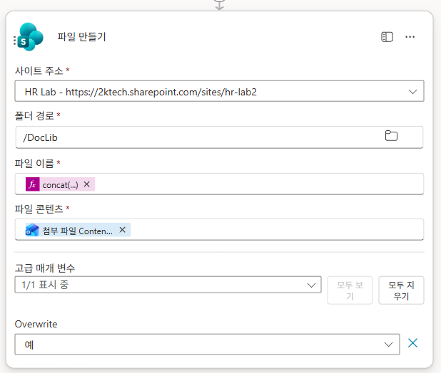
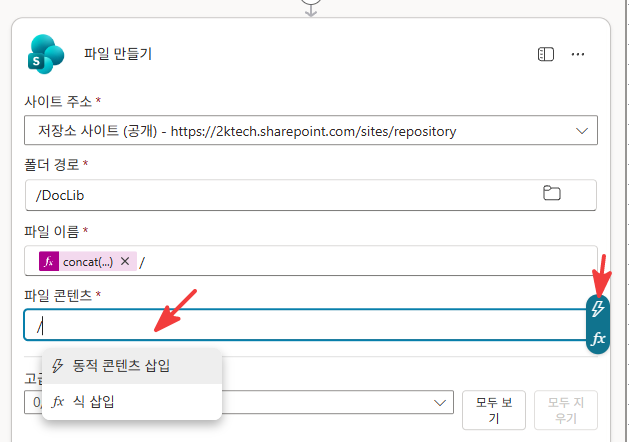
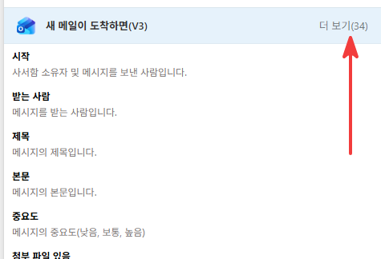
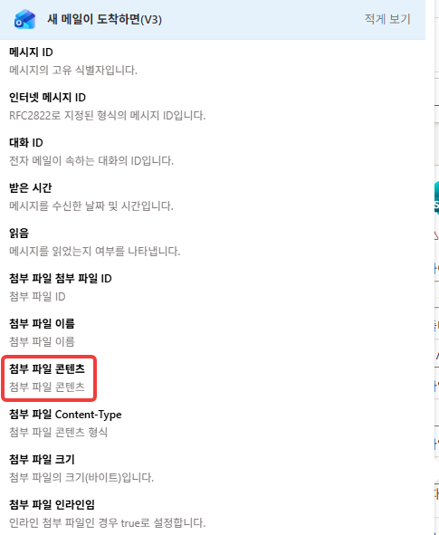

# 1-3. SharePoint 적재 — 파일 저장 + 항목 만들기
{: .no_toc }

<details open markdown="block">
  <summary>목차</summary>
  {: .text-delta }
1. TOC
{:toc}
</details>

---

## 🎯 학습 목표

- 첨부 이력서 PDF를 **안전한 파일명 규칙**으로 문서 라이브러리에 저장할 수 있다.
- AI가 추출한 정형 필드를 **지원자 마스터 목록 항목**으로 만들 수 있다.
- 저장된 파일의 URL을 **이력서링크** 컬럼에 연결할 수 있다.

## ⏱ 예상 소요 시간

{: .time }
약 16분

---

## 준비물

- 1-2까지 완료한 **적재 흐름**(AI 추출 출력 확보)
- Unit 0의 **지원자 마스터** 목록 + **이력서 보관함** 라이브러리

---

## 개념

적재는 두 곳에 나눠 저장합니다.

| 대상 | 무엇을 | 왜 |
|---|---|---|
| 이력서 보관함 (문서함) | 원본 PDF 그대로 | 원문 열람·심층 질의용 증거 보관 |
| 지원자 마스터 (목록) | 추출한 정형 필드 + 요약 + 링크 | 흐름·에이전트가 읽고 쓰는 데이터 |

목록 항목에는 원본 PDF를 직접 넣지 않고, **보관함에 저장한 파일의 링크(URL)** 만 `이력서링크`로 연결합니다. 원문이 필요할 때만 이 링크로 그 1건을 가져옵니다.

---

## 단계별 가이드

### 1단계. 파일 만들기 — 이력서 보관함에 PDF 저장

반복 안에서 `+ 작업 추가`를 클릭하고 검색창에 `파일 만들기`를 입력합니다. **SharePoint** 아래의 **`파일 만들기`** 를 선택합니다.

<!-- SCREENSHOT: u1-3-s01 — 작업 추가 패널, SharePoint > 파일 만들기 선택 -->


액션이 추가되면 아래와 같이 채웁니다.

| 항목 | 값 |
|---|---|
| 사이트 주소 | `채용보조_쉐어포인트_사이트` 환경 변수 칩 |
| 폴더 경로 | `/DocLib` |
| 파일 이름 | 아래 식 (식 삽입으로 입력) |
| 파일 콘텐츠 | 첨부 파일 콘텐츠 (아래 안내 참조) |
| Overwrite | 예 |

{: .note }
사이트 주소 필드도 URL을 직접 입력하지 않고 **동적 콘텐츠 삽입** → 환경 변수 섹션에서 `채용보조_쉐어포인트_사이트` 칩을 선택합니다. 2단계 항목 만들기의 사이트 주소도 동일하게 처리합니다.

**파일 이름 식 작성 — 식 삽입 사용**

파일 이름 필드에 커서를 두면 **`/`** 입력 시 팝업이 뜨거나, 필드 오른쪽 **`fx`** 버튼을 클릭하면 **식 삽입** 편집기가 열립니다. 아래 식을 입력합니다.

```
concat(
  formatDateTime(utcNow(), 'yyyyMMdd_HHmmss'),
  '_',
  substring(guid(), 0, 8),
  slice(첨부 파일 이름, lastIndexOf(첨부 파일 이름, '.'))
)
```

각 함수의 역할:

| 함수 | 역할 |
|---|---|
| `formatDateTime(utcNow(), 'yyyyMMdd_HHmmss')` | 메일 수신 시각(UTC) → `20260608_142530` 형식 |
| `substring(guid(), 0, 8)` | 36자 UUID 앞 8자리만 → 충돌 방지 고유값 |
| `slice(..., lastIndexOf(..., '.'))` | 원본 파일명에서 점(.) 이후 확장자만 추출 → `.pdf` |
| `concat(...)` | 세 부분을 `_`로 이어 붙여 최종 파일명 조합 |

결과 예시: `20260608_142530_a1b2c3d4.pdf`

<!-- SCREENSHOT: u1-3-s02 — 파일 만들기 액션 완성 (파일 이름=concat 식 칩, 파일 콘텐츠=첨부 파일 콘텐츠 칩) -->


{: .important }
**파일명에 원본 파일명·메일 주소를 넣지 않습니다.** 원본 파일명에 공백이 있으면 채팅·승인 카드에서 링크가 공백에서 잘려 깨집니다(실제로 겪은 버그). 그래서 `{수신시각}_{GUID 8자리}{확장자}`로 **공백 없는 고유 이름**을 만듭니다.

{: .note }
식 편집기가 2-인수 `substring`을 거부하는 경우가 있어, 확장자 추출은 `slice(name, lastIndexOf(name, '.'))` 로 점(.)부터 끝까지 잘라 씁니다. `guid()`는 36자라 앞 8자만 사용합니다.

**파일 콘텐츠 연결 — 위치 찾기**

파일 콘텐츠는 트리거의 **첨부 파일 콘텐츠**를 연결해야 하는데, 이 항목은 기본 목록에 보이지 않아 세 단계를 거쳐야 합니다.

① 파일 콘텐츠 필드에 커서를 두고 **`/`** 를 입력하거나 필드를 클릭하면 팝업이 열립니다. **`동적 콘텐츠 삽입`** 을 선택합니다.

<!-- SCREENSHOT: u1-3-s03 — 파일 콘텐츠 필드 클릭 → 동적 콘텐츠 삽입 선택 -->


② 동적 콘텐츠 목록에서 `새 메일이 도착하면(V3)` 섹션 옆 **`더 보기(34)`** 를 클릭합니다.

<!-- SCREENSHOT: u1-3-s04 — 트리거 섹션 '더 보기(34)' 클릭 -->


③ 확장된 목록에서 **`첨부 파일 콘텐츠`** 를 선택합니다.

<!-- SCREENSHOT: u1-3-s05 — 확장 목록에서 첨부 파일 콘텐츠 선택 -->


### 2단계. 항목 만들기 — 지원자 마스터에 적재

SharePoint **항목 만들기** 액션을 추가하고 필드를 매핑합니다.

| 컬럼(내부명) | 값 |
|---|---|
| 제목(Title) | 아래 식 |
| ApplicantName | AI 출력 · 지원자명 |
| Email | AI 출력 · 이메일 |
| JobPosition | AI 출력 · 지원직군 |
| CareerLevel | AI 출력 · 경력사항 |
| AIResumeSummary | AI 출력 · 이력서요약 |
| ResumeLink | 1단계에서 만든 파일의 **링크(경로)** — 아래 식 참조 |

**ResumeLink 식**

ResumeLink 필드도 **식 삽입**으로 아래를 입력합니다.

```
concat(
  parameters('채용보조_쉐어포인트_사이트'),
  outputs('파일_만들기')?['body/Path']
)
```

| 부분 | 역할 |
|---|---|
| `parameters('채용보조_쉐어포인트_사이트')` | 환경 변수에 저장된 SP 사이트 URL (예: `https://2ktech.sharepoint.com/sites/hr-lab2`) |
| `outputs('파일_만들기')?['body/Path']` | 1단계 파일 만들기 액션이 반환한 파일 경로 (예: `/DocLib/20260608_a1b2c3d4.pdf`) |
| `concat(...)` | 두 값을 이어 붙여 완전한 파일 URL 완성 |

{: .note }
`parameters()`는 흐름 안에 사이트 URL을 하드코딩하지 않고 **환경 변수**에서 읽어오는 방식입니다. 사이트 URL이 바뀌어도 환경 변수 한 곳만 고치면 흐름 전체에 반영됩니다(Unit 0에서 등록).

제목(Title) 식:

식 삽입 편집기를 열고 아래처럼 입력합니다. `지원자명`·`지원직군` 자리는 텍스트가 아니라 **동적 콘텐츠 칩**을 삽입해야 합니다.

```
concat('[', formatDateTime(utcNow(), 'yyyy-MM-dd'), ']',
       «지원자명 칩», '_', «지원직군 칩»)
```

{: .important }
`«지원자명 칩»`·`«지원직군 칩»`은 키보드로 입력하는 텍스트가 아닙니다. 식 편집기 안에서 커서를 해당 위치에 놓고 **동적 콘텐츠 삽입**(또는 `'/'` 메뉴)을 열어 **AI 출력 섹션 → 지원자명 / 지원직군**을 선택하면 칩 형태로 삽입됩니다.

결과 예시: `[2026-06-08]문지아_기획/전략`

{: .warning }
`AIResumeSummary`는 **일반 텍스트** 컬럼이어야 합니다(Unit 0에서 그렇게 설정). 서식 있는 텍스트면 AI 요약이 `<div class="ExternalClass...">` 같은 HTML 래퍼와 함께 저장되어 승인 카드·챗봇에서 태그가 노출됩니다.

{: .note }
`ReviewStatus`(검토상태)·`AIFitLevel`·`NeedsInterviewConfirm`은 적재 흐름이 채우지 않습니다. 검토상태는 기본값 `검토중`으로 시작하고, 나머지는 이후 에이전트/면접 확정 흐름이 다룹니다.

---

## ✅ 체크포인트

- [ ] **파일 만들기**가 이력서 보관함에 `{시각}_{GUID8}.pdf` 형식으로 PDF를 저장합니다.
- [ ] **항목 만들기**가 지원자 마스터에 6개 필드 + 제목 + 이력서링크를 채웁니다.
- [ ] 제목(Title)이 `[날짜]이름_직군` 형식으로 생성됩니다.
- [ ] AIResumeSummary가 **일반 텍스트**로 매핑되어 있습니다.

---

## 핵심 정리

| 항목 | 내용 |
|---|---|
| 2곳 저장 | 원본 PDF는 보관함, 정형 필드는 목록. |
| 파일명 규칙 | `{수신시각}_{GUID8}{확장자}` — 공백 없는 고유명으로 링크 보호. |
| 이력서링크 | 목록은 PDF를 직접 포함하지 않고 링크만 보관한다. |
| 일반 텍스트 | 요약 컬럼은 일반 텍스트여야 태그 누출이 없다. |

---

## 👉 다음 단계

흐름이 완성되었습니다. 실제 메일을 보내 6명이 제대로 적재되는지 확인합니다.

[1-4. 실메일로 적재 테스트 →](./u1-4-test.html)
