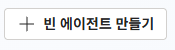
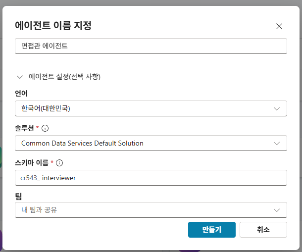
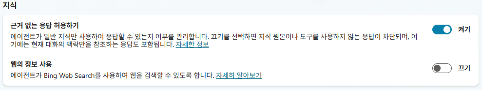
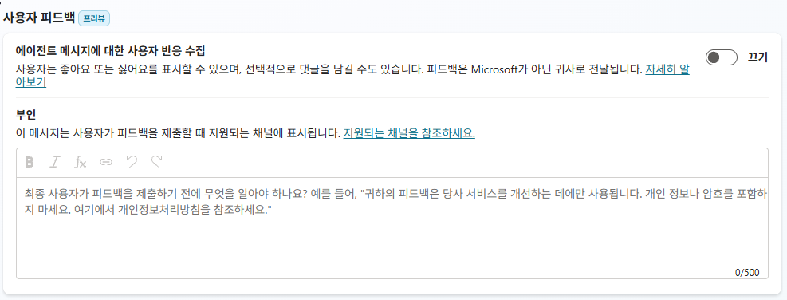

# 3-1. 면접관 에이전트 생성
{: .no_toc }

  
목차

  {: .text-delta }
1. TOC
{:toc}

---

## 🎯 학습 목표

- Copilot Studio(이하 CS)에서 **면접관 에이전트**를 생성할 수 있다.
- 에이전트를 구성하는 요소(이름·설명·지침·Knowledge·도구)의 큰 그림을 파악한다.
- 이번 유닛에서 만들 범위(생성·Knowledge·지침)와 다음 유닛(도구 연결)의 경계를 이해한다.

## ⏱ 예상 소요 시간

{: .time }
약 11분

---

## 준비물

- **Copilot Studio 환경** 접근 (강의에서 지정한 실습 환경)
- 채용 솔루션이 사는 **SharePoint(HR Lab)** 와 같은 테넌트

---

## 개념

지금까지 만든 두 흐름(적재·승인)은 **사람의 개입 없이 실행되는 백그라운드 자동화**였습니다. 이번 유닛부터는 채용 담당자가 **대화로 묻고 답을 받는** 면접관 에이전트를 만듭니다.

에이전트는 크게 네 가지로 구성됩니다.

| 요소 | 역할 | 이 과정에서 |
|---|---|---|
| 지침(Instructions) | 에이전트의 행동 규칙 | 3-3에서 작성, 이후 유닛마다 진화 |
| Knowledge | 답변의 기준이 되는 참고 문서 | 3-2에서 4종 등록 |
| 도구(Tools) | 외부 데이터를 읽고 쓰는 연결 | Unit 4–5에서 연결 |
| 토픽(Topics) | 대화 흐름 정의 | 필요 시 부분 활용 |

{: .note }
이번 유닛에서는 **지침과 Knowledge만** 갖춘 에이전트를 만듭니다. 도구가 없는 상태에서 "기준은 알지만 데이터는 모르는" 한계를 직접 확인하는 것(3-4)이 다음 유닛의 동기가 됩니다.

---

## 단계별 가이드

### 1단계. 새 에이전트 만들기

CS 홈에서 **`+ 새 에이전트`(또는 만들기)** 를 선택합니다. 대화형 생성 대신 **건너뛰어 구성(Skip to configure)** 으로 빈 에이전트에서 시작합니다.

{: .note }
대화형 생성기로도 만들 수 있지만, 이 실습은 각 구성 요소를 직접 다루며 이해하는 것이 목적이라 **빈 에이전트**에서 시작합니다.

### 2단계. 이름·설명 설정

| 항목 | 값 |
|---|---|
| 이름 | `면접관 에이전트` |
| 설명 | 예: `승인된 지원자를 조회·평가하고 면접 질문을 돕는 채용 도우미` |

### 3단계. 환경·모델 확인

에이전트가 **올바른 환경**(개발 환경)에 만들어졌는지, 기본 생성형 모델이 의도한 것인지 확인합니다.

<!-- SCREENSHOT: u3-s03 — 에이전트 생성 완료 화면(개요) -->

{: .warning }
CS는 기본 진입 시 다른 환경(예: default)으로 진입할 수 있습니다. 채용 솔루션과 같은 환경에서 만들어야 이후 SharePoint 도구·흐름과 매끄럽게 연결됩니다.

### 4단계. 솔루션에 에이전트 추가

빈 에이전트를 만들면 기본적으로 **Common Data Services Default Solution** 에 들어갑니다. 그러나 이 과정의 적재·승인 흐름, 연결 참조, **환경 변수(사이트 URL 등)** 는 **`HR 채용 자동화` 솔루션**에 모여 있습니다. 면접관 에이전트도 같은 솔루션에 넣어 두면 한곳에서 관리되고, Unit 4에서 도구 입력을 **환경 변수로 바인딩**할 수 있습니다.

- **생성 시 지정:** 2단계의 **에이전트 설정 → 솔루션**에서 처음부터 `HR 채용 자동화`를 선택하면 한 번에 끝납니다.
- **생성 후 추가:** 이미 만들었다면 Power Apps → **솔루션 → `HR 채용 자동화` → 기존 항목 추가 → 에이전트 → 면접관 에이전트** 로 추가합니다.

<!-- SCREENSHOT: u3-s03d — 솔루션에 에이전트 추가(기존 항목 추가 → 에이전트) -->

{: .important }
**왜 중요한가 (환경 변수 바인딩의 전제):** Unit 4에서 SharePoint 도구의 **사이트 주소**를 하드코딩 대신 **환경 변수(`HR_SPSiteURL`)** 로 바인딩하려면, 그 환경 변수가 **에이전트와 같은 솔루션**에 있어야 입력값 선택의 **환경** 탭에 나타납니다. 서로 다른 솔루션에 있으면 picker에 보이지 않아 바인딩할 수 없습니다.

### 5단계. "근거 없는 응답 허용" 확인 (ON 유지)

**설정 → 생성형 AI → 지식** 섹션에서 **`근거 없는 응답 허용`** 토글을 확인합니다. 새로 만든 에이전트는 기본값이 **켜기(ON)** 이며, 이 실습에서는 **기본값 그대로 유지합니다.**

{: .important }
새로 만든 에이전트는 이제 기본적으로 **생성형 오케스트레이션**을 사용하고, `근거 없는 응답 허용` 설정은 이 모드에서만 작동합니다. **켜면** 지식 원본·도구를 호출하지 않은 턴에도 모델의 일반 지식으로 응답할 수 있고, **끄면** 그런 턴의 응답이 전부 차단되어 폴백으로 넘어갑니다. 여기엔 인사·되묻기·후속 질문, 그리고 **"그건 실시간 데이터라 지금은 도구가 없어 확인할 수 없다"처럼 에이전트가 자기 경계를 스스로 설명하는 응답**까지 포함됩니다.

{: .note }
역설적이지만 **Knowledge만으로 답하게 하고 싶을 때도 이 토글은 켜 두는 것이 적절합니다.** 끄면 3-4에서 볼 "경계를 스스로 설명하는" 대화가 차단되어 시연이 폴백 메시지로 중단됩니다. 끄기는 "지식·도구를 사용한 응답만 내보낸다"는 강한 규제가 필요한 운영 환경에서나 선택합니다. 출처: [Microsoft Learn — Allow ungrounded responses](https://learn.microsoft.com/en-us/microsoft-copilot-studio/knowledge-copilot-studio#allow-ungrounded-responses).

같은 **생성형 AI 설정** 페이지의 **사용자 피드백 수집**(좋아요/싫어요·댓글)은 이 실습에 필요 없는 정보 집계이므로 **끄기(기본값)** 를 유지합니다.

---

## ✅ 체크포인트

- [ ] **면접관 에이전트**가 생성돼 있습니다.
- [ ] 이름·설명이 채워져 있습니다.
- [ ] 올바른 개발 환경에 만들어졌습니다.
- [ ] 면접관 에이전트가 **`HR 채용 자동화` 솔루션**에 들어 있습니다(환경 변수 바인딩 대비).
- [ ] **`근거 없는 응답 허용`이 켜기(ON)** 로 되어 있습니다(기본값 그대로).

---

## 핵심 정리

| 항목 | 내용 |
|---|---|
| 에이전트 4요소 | 지침·Knowledge·도구·토픽. |
| 이번 범위 | 지침 + Knowledge까지. 도구는 다음 유닛. |
| 빈 에이전트 | 각 요소를 직접 다루기 위해 건너뛰어 구성으로 시작. |
| 솔루션 배치 | 에이전트를 코스 솔루션(`HR 채용 자동화`)에 둬야 흐름·연결·환경 변수와 한곳에서 관리되고, 환경 변수 바인딩이 가능. 기본은 Default Solution이라 생성 후 추가 필요. |
| 근거 없는 응답 허용 | ON 유지(기본값). 끄면 경계 설명·인사 같은 비그라운딩 응답이 차단됨. 생성형 오케스트레이션에서만 작동. |

---

## 👉 다음 단계

에이전트가 평가의 기준으로 삼을 **Knowledge 4종**을 등록합니다.

[3-2. Knowledge 4종 업로드 + 인덱싱 →](./u3-2-knowledge.html)
