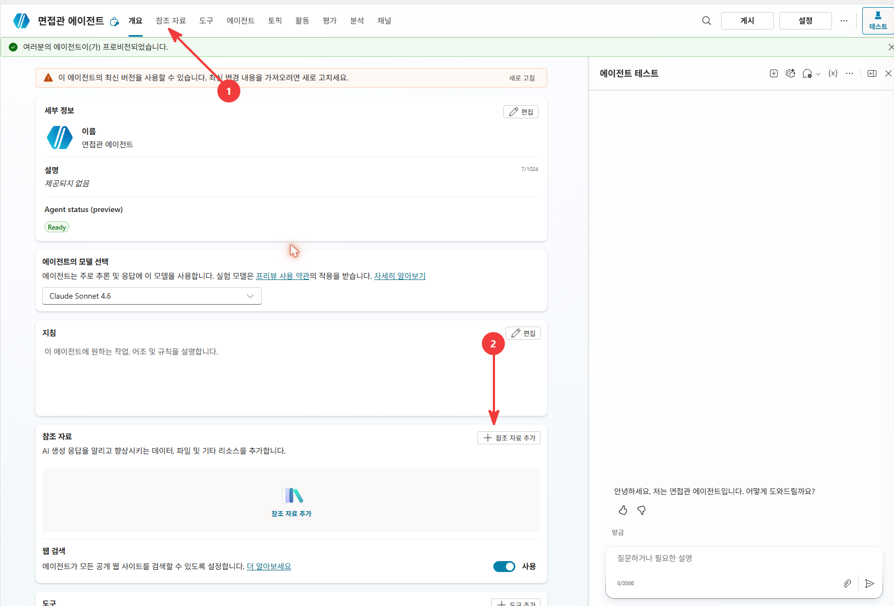
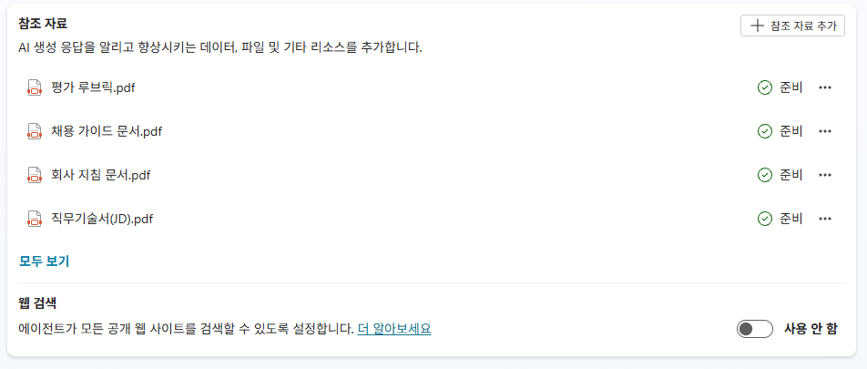

# 3-2. Knowledge 4종 업로드 + 인덱싱
{: .no_toc }

  
목차

  {: .text-delta }
1. TOC
{:toc}

---

## 🎯 학습 목표

- 평가 기준이 되는 **Knowledge 4종**을 에이전트에 직접 업로드한다.
- 4종 각각의 **역할과 변경 빈도**를 구분한다.
- **이력서 원문을 Knowledge에 넣지 않는** 설계 이유를 설명할 수 있다.

## ⏱ 예상 소요 시간

{: .time }
약 14분
| 버퍼(인덱싱 대기) | 5분+ |

---

## 준비물

- 3-1에서 만든 **면접관 에이전트**
- 업로드용 **PDF 4종** (아래에서 미리 다운로드하세요)

| 파일 | 역할 |
|---|---|
| [📥 채용 가이드 문서.pdf](../../assets/knowledge_base/채용%20가이드%20문서.pdf) | 공통 평가기준·경력 레벨 정의 |
| [📥 직무기술서(JD).pdf](<../../assets/knowledge_base/직무기술서(JD).pdf>) | 직군별 필수/우대 요건 |
| [📥 회사 지침 문서.pdf](../../assets/knowledge_base/회사%20지침%20문서.pdf) | 인재상 4축 |
| [📥 평가 루브릭.pdf](../../assets/knowledge_base/평가%20루브릭.pdf) | 채점 규칙 (메타 레이어) |

---

## 개념

Knowledge는 에이전트가 답할 때 참고하는 **기준 문서**입니다. 이 채용 솔루션의 Knowledge는 4종으로 구성됩니다.

| 소스 | 역할 | 변경 빈도 |
|---|---|---|
| 채용 가이드(공통) | 공통 평가기준 **개념 정의** + 경력 레벨 정의 | 낮음 |
| 직무기술서(JD) | 직군별 필수/우대 요건 | 높음 (포지션마다) |
| 회사 지침 | 인재상 4축 | 거의 고정 |
| 평가 루브릭 | 위 셋을 점수로 환산하는 **채점 규칙**(메타 레이어) | 낮음 |

이 4종은 **소량·안정·전원 공유** 문서라 RAG(검색 증강 생성)의 정석 사용처입니다. 그래서 CS에 직접 업로드합니다.

{: .important }
**이력서 원문은 Knowledge에 등록하지 않습니다.** 수십·수백 명의 이력서를 RAG에 업로드하면 ① 업로드 한도를 초과하고 ② 검색이 **등록된 이력서 전체(코퍼스)** 에서 일어나 **동명이인·교차 오염**(다른 지원자 내용 섞임)이 필연입니다. 이력서는 **대상 데이터**라 SharePoint 목록에 보관하고, 원문이 필요한 경우에는 링크로 해당 1건만 가져옵니다(Unit 4의 면접 질문).

{: .note }
대신 적재 흐름(Unit 1)이 만든 **이력서요약**이 일상 작업의 기본 재료입니다 — 빠르고, 목록에 상시 노출되어 전수 스캔이 가능합니다. **"요약 = 기본 / 원문 = 필요할 때만"** 이라는 2단 구조는 Unit 4에서 다시 만납니다.

{: .note }
**코퍼스(corpus)** = 검색 대상이 되는 문서 전체 집합. RAG는 이 집합 전체에서 관련 조각을 찾습니다. 그래서 이력서 수백 개를 한 코퍼스에 올리면 "이 한 명"만 정확히 참조되는 것이 보장되지 않습니다.

{: .note }
**루브릭이 키스톤입니다.** 루브릭은 다른 셋의 내용을 복제하지 않고 참조만 합니다 — R1은 JD를, R2는 채용 가이드의 경력 레벨을, R5는 회사 지침의 인재상을 가리킵니다. "정의는 각 문서, 채점은 루브릭"이라는 분업입니다.

---

## 단계별 가이드

### 1단계. Knowledge 추가 화면 열기

면접관 에이전트의 **Knowledge** 탭에서 **`+ 추가`** 를 선택하고 **파일 업로드**를 고릅니다.

### 2단계. PDF 4종 업로드

아래 4개 PDF를 업로드합니다.

| 파일 | 권장 설명(Description) |
|---|---|
| 채용 가이드 문서.pdf | `공통 평가기준과 경력 레벨 정의` |
| 직무기술서(JD).pdf | `직군별 필수·우대 요건 목록` |
| 회사 지침 문서.pdf | `인재상 4축 및 채용 원칙` |
| 평가 루브릭.pdf | `지원자 적합도를 등급으로 매기는 채점 규칙` |

각 파일에 **설명(Description)** 을 입력해 두면, 에이전트가 질문에 맞는 문서를 더 잘 선택합니다.

<!-- SCREENSHOT: u3-s05 — 4종 PDF 업로드 + 설명 -->

{: .warning }
DOCX·HWP보다 **PDF**가 인덱싱이 안정적입니다. 원본이 Markdown이면 PDF로 변환하여 업로드합니다(이 과정의 4종은 PDF가 준비돼 있습니다).

### 3단계. 인덱싱 완료 대기

업로드 후 각 문서가 **인덱싱(Ready)** 될 때까지 기다립니다. 소량 4종은 보통 수 분 내 완료됩니다.

{: .note }
인덱싱이 완료되기 전에는 에이전트가 그 문서를 검색하지 못해 해당 내용을 모른다고 답할 수 있습니다. 다음 서브유닛(지침)과 시연(3-4)은 **4종이 모두 Ready 된 뒤** 진행하세요. 강의에서는 이 대기 시간을 지침 작성과 겹쳐 흡수합니다.

---

## ✅ 체크포인트

- [ ] Knowledge에 PDF **4종**이 업로드돼 있습니다.
- [ ] 각 문서에 역할을 설명하는 **설명**이 달려 있습니다.
- [ ] 4종이 모두 **인덱싱 완료(Ready)** 상태입니다.
- [ ] 이력서 원문은 Knowledge에 **없습니다**.

---

## 핵심 정리

| 항목 | 내용 |
|---|---|
| Knowledge 4종 | 채용 가이드·JD·회사 지침·평가 루브릭. 소량·안정·공유. |
| 루브릭 = 키스톤 | 내용 복제 없이 다른 셋을 참조하는 채점 규칙. |
| 이력서 제외 | 대상 데이터라 SP에. RAG는 교차 오염 필연. |
| 인덱싱 대기 | Ready 전엔 검색 불가 → 지침 작성과 병행. |

---

## 👉 다음 단계

에이전트의 행동 규칙 — 무엇을 Knowledge로, 무엇을 데이터로 다룰지 — 을 지침으로 작성합니다.

[3-3. 에이전트 지침 작성 →](./u3-3-instructions.html)
