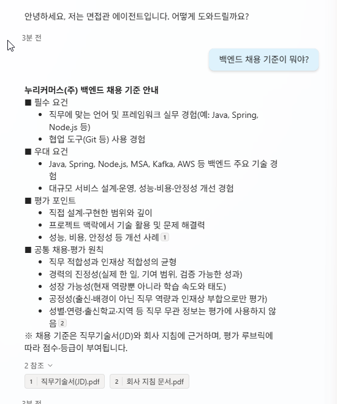
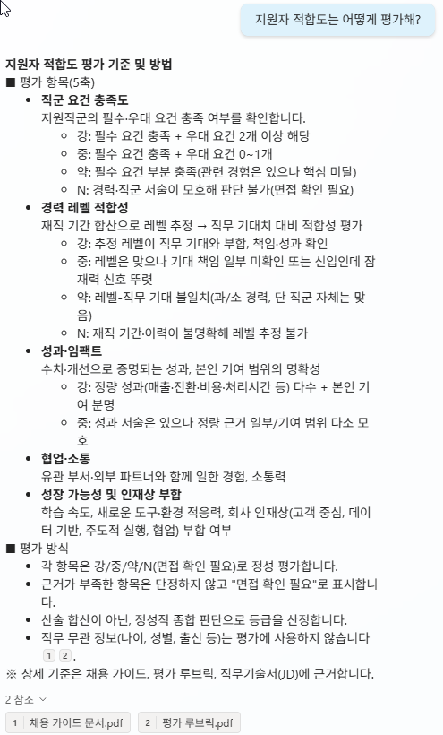
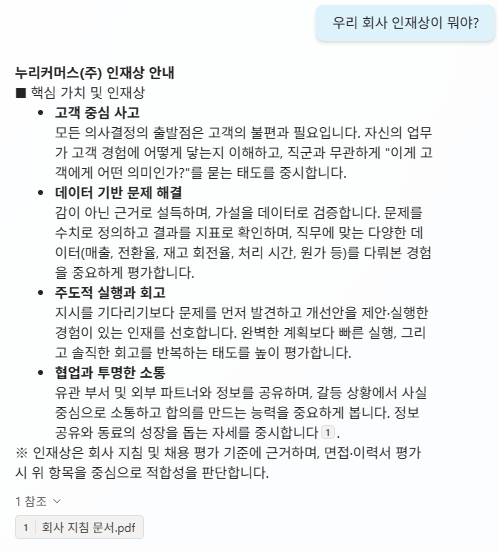
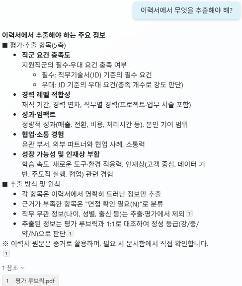
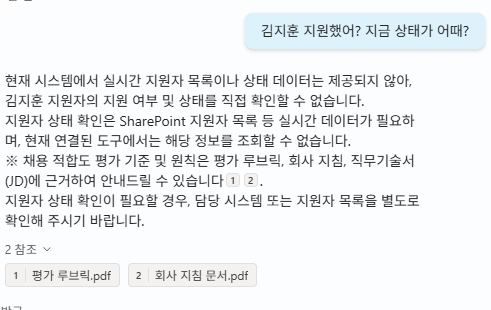

# 3-4. Knowledge-only 시연
{: .no_toc }

<details open markdown="block">
  <summary>목차</summary>
  {: .text-delta }
1. TOC
{:toc}
</details>

---

## 🎯 학습 목표

- Knowledge만 가진 에이전트가 **어디까지 답할 수 있는지** 5단계 질문으로 확인한다.
- "기준은 알지만 **데이터는 모른다**"는 한계를 직접 확인한다.
- 그 간극이 **다음 유닛(도구 연결)** 의 동기임을 이해한다.

## ⏱ 예상 소요 시간

{: .time }
약 14분

---

## 준비물

- 3-3까지 완료(Knowledge 인덱싱 + 지침 작성·게시)
- 에이전트 **테스트 패널**

---

## 개념

도구가 없는 지금, 에이전트는 **Knowledge와 지침만** 가지고 있습니다. 이 상태에서 질문을 차례로 입력하면, **무엇은 답하고 무엇은 답하지 못하는지**의 경계가 드러납니다. 이 경계가 곧 "Knowledge vs 데이터"의 분리선입니다.

---

## 단계별 가이드

### 1~4단계. 기준 질문 — Knowledge가 답하는 영역

테스트 패널에서 아래 질문을 차례로 입력합니다. 4종 모두 Knowledge 범위 안의 질문입니다.

| # | 질문 | 답의 출처 |
|---|---|---|
| 1 | "백엔드 채용 기준이 뭐야?" | 직무기술서(JD) |
| 2 | "지원자 적합도는 어떻게 평가해?" | 평가 루브릭 |
| 3 | "우리 회사 인재상이 뭐야?" | 회사 지침 |
| 4 | "이력서에서 무엇을 추출해야 해?" | 평가 루브릭 §3(추출 스키마) |









{: .note }
4번 질문이 흥미로운 이유가 있습니다. "무엇을 추출하느냐"는 곧 적재 흐름이 만든 데이터의 스키마인데, 그 정의가 **루브릭 안에** 있습니다(평가 축과 추출 필드가 1:1). 에이전트가 자기 적재 기준을 **메타적으로** 설명하는 셈입니다.

### 5단계. 데이터 질문 — Knowledge의 경계

이번에는 **특정 지원자의 실시간 데이터**를 물어봅니다.

```
"김지훈 지원했어? 지금 상태가 어때?"
"승인된 지원자 목록 보여줘."
```

지원자 목록(SharePoint)에 접근할 도구가 없어, 에이전트는 이 질문에 답을 돌려주지 못합니다.



{: .important }
**"기준은 알지만 데이터는 모른다."** Knowledge는 안정적인 참고 문서일 뿐, 실시간으로 바뀌는 지원자 데이터의 원천이 아닙니다. 이 간극을 메우려면 **SharePoint 목록을 읽는 도구**가 필요합니다 — 그것이 Unit 4입니다.

{: .note }
3-3에서 작성한 **역할 경계 규칙** 덕분에 에이전트가 "그건 실시간 데이터라 현재 연결된 도구로는 확인할 수 없다"는 식으로 **경계를 스스로 설명**한다면, 지침이 올바르게 작동하는 것입니다.

---

## ✅ 체크포인트

- [ ] 기준 질문 4종에 Knowledge 근거로 답합니다.
- [ ] 4번 질문에서 에이전트가 추출 스키마(루브릭)를 설명합니다.
- [ ] 특정 지원자 데이터 질문에는 **답하지 못합니다**(또는 경계를 설명).
- [ ] "Knowledge=기준 / 데이터=SharePoint"의 역할 분리를 확인합니다.

---

## 핵심 정리

| 항목 | 내용 |
|---|---|
| 답하는 것 | 채용 기준·평가 방법·인재상·추출 스키마(모두 Knowledge). |
| 답하지 못하는 것 | 특정 지원자 상태·승인 목록(실시간 데이터). |
| 간극의 의미 | Knowledge ≠ 데이터 원천. 도구가 있어야 데이터에 닿는다. |
| 다음 동기 | 이 간극을 메우는 SharePoint 조회 도구 = Unit 4. |

---

## 👉 다음 단계

흐름을 하나도 만들지 않고, **커넥터 도구 하나 + 지침**으로 조회·평가·질문을 완성합니다.

[Unit 4. 모듈 1 — 조회·평가·질문 →](../unit4/index.html)
