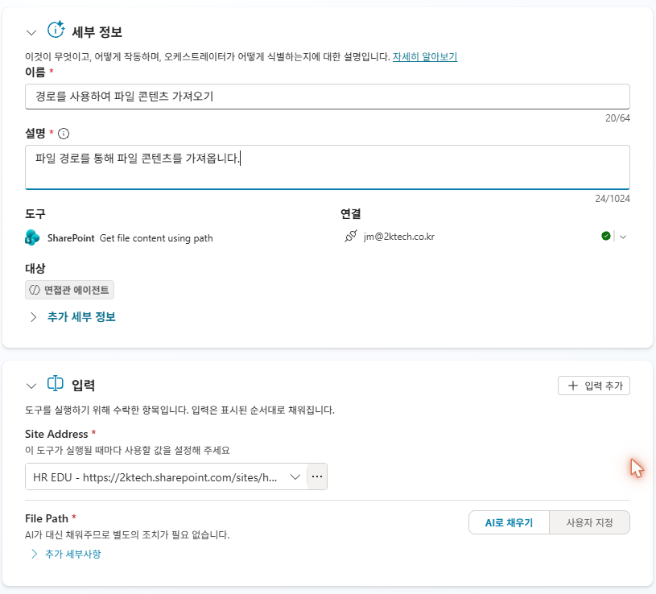
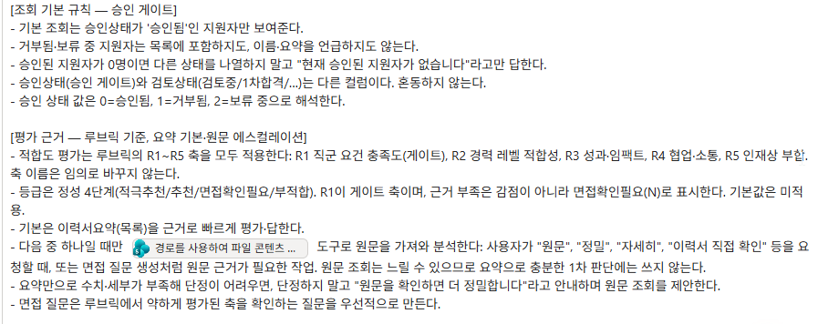
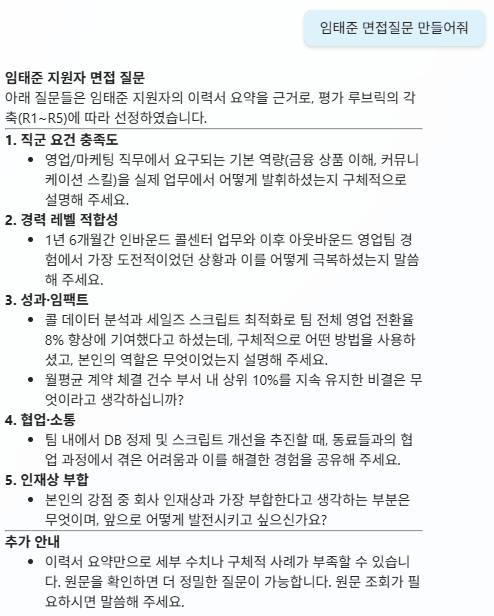
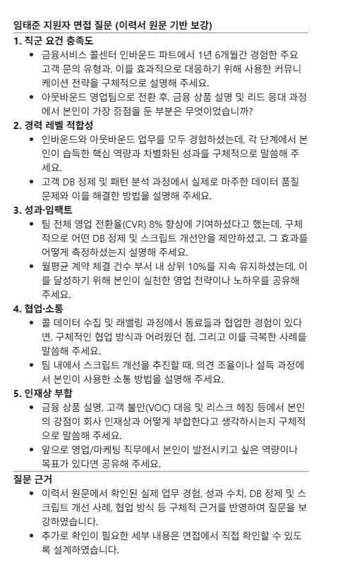
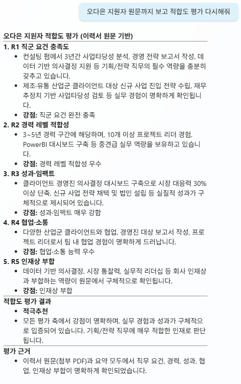

# 4-4. C3 면접 질문 생성
{: .no_toc }

<details open markdown="block">
  <summary>목차</summary>
  {: .text-delta }
1. TOC
{:toc}
</details>

---

## 🎯 학습 목표

- 심화 질문과 불확실성 확인, 두 이유로 **2단 구조**(요약 기본 / 원문 에스컬레이션)가 필요함을 이해한다.
- 4-3의 `[적합도 평가]` 블록을 **통합 블록으로 교체**하고, 적합도 평가·면접 질문이 같은 2단 구조임을 확인한다.
- 원문 가져오기 수단(**경로사용 파일콘텐츠**)과 그 비용(로딩이 느림)을 안다.
- 원문 확인 후에도 판단이 서지 않으면 **보류**로 표시하고 Unit 5로 넘기는 경로를 안다.
- 원문 접근 권한은 **에이전트가 아니라 연결 신원·SharePoint 권한**이 정한다는 것을 안다.

## ⏱ 예상 소요 시간

{: .time }
약 10분

---

## 준비물

- 4-3까지 완료(C2 적합도 평가 지침 추가)
- 이력서 원본이 저장된 **이력서 보관함** + 항목의 **이력서링크**

---

## 개념

적합도 평가(C2)와 면접 질문 생성(C3) 모두 **기본은 이력서요약**으로 합니다. 그런데 두 가지 상황에서 원문이 더 필요해집니다.

**심화 질문**: 요약 기반 면접 질문은 전반적인 흐름을 짚습니다. 하지만 "그 수치를 어떻게 달성했나요?", "그 의사결정에서 어떤 기준을 썼나요?" 같이 경험을 파고드는 날카로운 질문은 원문의 구체적 내용이 있어야 만들 수 있어요. 면접 질문은 깊을수록 좋습니다.

**불확실성 확인**: 4-3에서 오다은의 R3~R5가 "중"으로 나왔습니다. 이게 이 지원자가 실제로 성과가 약한 건지, 요약에서 수치가 빠진 건지 요약만으로는 알 수 없어요. 원문을 보면 판단할 수 있습니다 — 원문에 수치가 있다면 요약 문제였던 것이고, 없다면 "중"이 맞습니다. 보고도 판단이 서지 않으면 **검토상태를 보류**로 두고 Unit 5에서 처리할 수 있습니다.

이 두 경우를 하나의 구조로 정리하면 **2단 구조**: 기본은 요약(빠름·전수), 원문은 필요할 때만(느림·정밀). C2 적합도 평가와 C3 면접 질문 생성 모두 이 구조를 따릅니다.

{: .important }
**원본 이력서는 Knowledge에 넣지 않습니다.** 대신 그 지원자 항목의 **이력서링크로 그 1건만** 가져옵니다(fetch-by-link). 수백 명의 이력서를 RAG에 올리면 검색이 **올려둔 이력서 전체 더미(코퍼스)** 에서 일어나 **다른 지원자 내용이 섞이지만**, 링크로 1건만 가져오면 지원자 수가 아무리 많아도 안전합니다. **전체에서 뒤지는 검색이 아니라, 링크로 그 한 명만 정확히 지정하여 가져오는 것**입니다.

---

## 단계별 가이드

### 1단계. 원문 가져오기 수단 연결 — 경로사용 파일콘텐츠

원문은 SharePoint **`경로로 파일 콘텐츠 가져오기`(Get file content using path)** 도구로 가져옵니다. **사이트는 고정**하고, 어떤 파일을 가져올지 **파일 경로는 에이전트(AI)가 이력서링크에서 채우게** 합니다.



{: .note }
C1·C2는 목록(요약·필드)만으로 되었지만, 원문은 파일이라 가져오는 수단이 하나 추가됩니다. 그래도 "여러 흐름"이 아니라, 한 지원자를 깊이 보기 위한 **1건 fetch**입니다. (커넥터 단독으로 PDF 내용까지 읽혀, "읽기=커넥터"가 여기서도 유지됩니다.)

{: .warning }
**원문 가져오기는 로딩이 꽤 깁니다.** 그래서 매번이 아니라 **요청·심층 시에만** 부릅니다(2단 구조). 라이브 시연 때는 응답이 늦을 수 있음을 미리 알려 두는 게 좋습니다.

### 2단계. 지침 블록 교체 — [평가 근거 — 루브릭 기준, 요약 기본·원문 에스컬레이션]

4-3에서 추가한 `[적합도 평가]` 블록을 **삭제**하고, 아래 통합 블록으로 **교체**합니다. 적합도 평가와 면접 질문 생성은 둘 다 같은 2단 구조(요약 기본/원문 에스컬레이션)를 쓰므로, 하나의 블록으로 합치는 게 더 명확합니다.

```
[평가 근거 — 루브릭 기준, 요약 기본·원문 에스컬레이션]
- 적합도 평가는 루브릭의 R1~R5 축을 모두 적용한다: R1 직군 요건 충족도(게이트), R2 경력 레벨 적합성, R3 성과·임팩트, R4 협업·소통, R5 인재상 부합. 축 이름은 임의로 바꾸지 않는다.
- 등급은 정성 4단계(적극추천/추천/면접확인필요/부적합). R1이 게이트 축이며, 근거 부족은 감점이 아니라 면접확인필요(N)로 표시한다. 기본값은 미적용.
- 기본은 이력서요약(목록)을 근거로 빠르게 평가·답한다.
- 다음 중 하나일 때만 「경로를 사용하여 파일 콘텐츠 가져오기」 도구로 원문을 가져와 분석한다:
  사용자가 "원문", "정밀", "자세히", "이력서 직접 확인" 등을 요청할 때,
  또는 면접 질문 생성처럼 원문 근거가 필요한 작업.
  원문 조회는 느릴 수 있으므로 요약으로 충분한 1차 판단에는 쓰지 않는다.
- 요약만으로 수치·세부가 부족해 단정이 어려우면, 단정하지 말고
  "원문을 확인하면 더 정밀합니다"라고 안내하며 원문 조회를 제안한다.
- 면접 질문은 루브릭에서 약하게 평가된 축을 확인하는 질문을 우선적으로 만든다.
```

{: .note }
R1~R5 축 이름과 등급 체계를 이 블록에 직접 명시해야 에이전트가 루브릭 Knowledge와 정확히 대조합니다. 루브릭 Knowledge가 **채점 기준(내용)** 을 제공하고, 이 블록이 **평가 방법(실행)** 을 정합니다.



### 3단계. 테스트 — 요약 기반 → 원문 보강

블록 교체 후 세 가지를 순서대로 확인합니다.

**1. 적합도 평가** — "김지훈 적합도 평가해줘"로 등급 + 축별 근거가 여전히 나오는지 봅니다. 블록이 교체됐어도 동작은 그대로여야 합니다.

**2. 면접 질문** — "김지훈 면접 질문 만들어줘"로 요약 기반 질문이 나오는지, "원문까지 보고 더 깊게"로 원문 fetch 후 수치·경험을 짚는 질문으로 보강되는지 확인합니다.





**3. 오다은 — 불확실성 확인 시나리오** — 4-3에서 R3~R5가 "중"이었던 오다은의 원문을 확인합니다. "오다은 원문까지 보고 적합도 다시 평가해줘"라고 요청합니다.



원문에 수치·경험이 있었다면 R3~R5 평가가 달라집니다 — 요약이 그걸 담지 못했던 것입니다. 원문에도 없다면 "중"이 맞고, 그대로 두면 됩니다. 만약 원문을 봤는데도 판단이 서지 않는다면 — **검토상태를 "보류"로** 두고 Unit 5로 넘깁니다.

{: .note }
보류는 결정을 미루는 게 아니라 **근거 부족 상황을 공식화**하는 액션입니다. 원문까지 봤는데 판단이 서지 않으면, 에이전트가 임의로 등급을 내리는 것보다 보류로 표시해 두는 게 데이터 정합성에 맞습니다. "지금 내릴 수 없는 판단은 미루는 것도 판단이다" — 이게 Unit 5 면접 확정 흐름과 이어지는 자연스러운 연결입니다.

{: .warning }
**원문 접근 권한은 에이전트가 막는 게 아닙니다.** 누가 이력서 파일을 읽을 수 있는지는 두 가지가 정합니다 — ① 커넥터의 **연결 신원**(작성자 연결이면 만든 사람 권한으로, 최종 사용자 인증이면 대화하는 사람 권한으로 읽음), ② **SharePoint 문서 라이브러리 자체의 권한**. 이 둘이 진짜(하드) 경계입니다. 지침·토픽은 "이 기능을 제공할지" 정도만 정할 뿐(소프트)이라, 보안 경계가 될 수 없습니다.

{: .note }
특히 **작성자 연결**을 쓰면 대화하는 모든 사용자가 "만든 사람이 볼 수 있는" 파일까지 받을 수 있습니다 — 의도와 다르면 위험합니다. 사용자별로 제한하려면 **최종 사용자 인증 + SharePoint 권한**으로 가야 합니다. "지침에 보여주지 마"라고 적는 건 우회 가능한 소프트 통제라 보안이 되지 못합니다.

---

## ✅ 체크포인트

- [ ] `[적합도 평가]` 블록이 `[평가 근거 — 루브릭 기준, 요약 기본·원문 에스컬레이션]`으로 교체되었습니다.
- [ ] 블록 내에 R1~R5 축 이름과 등급 체계(적극추천/추천/면접확인필요/부적합)가 명시되어 있습니다.
- [ ] 교체 후 적합도 평가(등급 + 축별 근거)가 정상 동작합니다.
- [ ] 기본 면접 질문이 **요약 기반**으로 생성됩니다.
- [ ] 원문 요청 시 **경로사용 파일콘텐츠**로 원본 1건을 가져옵니다.
- [ ] 원문 보강 질문이 구체적 수치·경험을 짚습니다.
- [ ] 오다은 원문 평가 시 요약 기반 결과와 차이가 나타납니다(또는 차이 없음 확인).
- [ ] "판단 불가" 상황에서 보류 처리 경로를 설명할 수 있습니다.

---

## 핵심 정리

| 항목 | 내용 |
|---|---|
| 블록 교체 | `[적합도 평가]` 삭제 → `[평가 근거 — 루브릭 기준, 요약 기본·원문 에스컬레이션]` 추가. R1~R5·등급 포함. C2·C3가 같은 구조라 하나로 합침. |
| C3 = 1건 fetch | 원문은 Knowledge ❌, 이력서링크로 그 1건만(경로사용 파일콘텐츠). |
| 2단 구조 동기 | ① 심화 질문(경험 파고들기), ② 불확실성 확인(R3~R5 중인데 수치 없을 때). |
| 불확실성 → 보류 | 원문 봐도 판단 불가 → 검토상태 "보류" → Unit 5 면접 확정 흐름으로 연결. |
| 교차 오염 회피 | 1건 fetch라 지원자 수와 무관하게 안전. |
| 권한 경계 = 다른 위치 | 연결 신원 + SharePoint 권한이 막는다. 지침은 보안 경계 아님(소프트). |

---

## 👉 다음 단계

여기까지가 **읽기는 커넥터+지침**의 절반입니다. 다음은 나머지 절반 — **상태를 바꾸는 일은 흐름**. 커넥터가 실패하는 지점을 본 뒤 흐름으로 전환합니다.

[Unit 5. 모듈 2 — 면접 확정 트랜잭션 →](../unit5/index.html)
