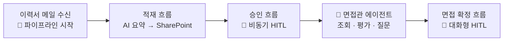

# 🤝 HR 채용 자동화 Lab에 오신 것을 환영합니다

**"AI에게 일을 맡기되, 결정은 사람이 내립니다."**

이 과정에서 여러분은 Copilot Studio와 Power Automate로 **이력서 접수부터 면접 확정까지** 이어지는 HR 채용 자동화 솔루션을 처음부터 끝까지 직접 만듭니다. 단순히 따라 만들고 끝나는 것이 아니라, **"이 일은 AI에게, 이 결정은 사람에게"** 를 가르는 설계 감각을 손에 쥐고 돌아가는 것이 목표입니다.

---

## 💡 이런 분들을 위해 준비했습니다

- Copilot Studio로 챗봇을 만들어 봤지만, **실제 업무 시스템(SharePoint·메일·승인)과 연결**해 본 적은 없는 분
- "이건 지침으로 될까, 흐름을 만들어야 할까?" — **경계 판단**이 늘 아리송했던 시티즌 개발자
- AI가 일하는 중간에 **사람의 검토·승인을 끼워 넣는 방법**(Human-in-the-Loop, 이하 HITL)이 궁금한 분

> **전제 조건**
> Power Automate / Copilot Studio 초급 과정을 이수했거나, 흐름·에이전트·Knowledge의 기본 개념을 알고 있는 분을 대상으로 합니다.
> 약어나 용어가 낯설면 [부록. 용어집](./docs/glossary.html)을 펴 두고 보세요.

---

## 🛠 하루 동안 완성하는 것

이력서가 메일로 도착하는 순간부터 면접 확정까지, 사람과 AI가 역할을 나눠 갖는 파이프라인입니다.

| 산출물 | 내용 | 빌드 |
|---|---|---|
| **적재 흐름** | 이력서 메일 수신 → AI 구조화 추출 → SharePoint 자동 적재 | *풀 빌드*{: .label .label-purple } |
| **승인 흐름** | AI 요약 품질을 사람이 검토 — Teams·Outlook 승인 카드 | *설정*{: .label .label-blue } |
| **면접관 에이전트** | 지원자 조회·적합도 평가·면접 질문 생성 | *조립*{: .label .label-green } |
| **면접 확정 흐름** | 챗봇 대화로 면접 확정 — 검토상태를 바꾸는 트랜잭션 | *풀 빌드*{: .label .label-purple } |

네 가지 모두 여러분이 직접 만듭니다. *풀 빌드*{: .label .label-purple }는 흐름 캔버스에서 **처음부터 끝까지 직접 짓는** 산출물, *설정*{: .label .label-blue }은 SharePoint 내장 기능 활성화, *조립*{: .label .label-green }은 커넥터·Knowledge·지침을 **연결·구성**하는 작업이라 빌드 부담이 한결 가볍습니다.

---

## 🌿 이 과정의 두 가지 핵심 질문

### 1. 사람은 어디에 개입하는가 — HITL 두 패턴

같은 "사람의 확인"이라도 쓰임새가 다릅니다. 두 패턴을 모두 직접 만들어 보고 적재적소를 익힙니다.

| | 비동기 HITL (Unit 2) | 대화형 HITL (Unit 5) |
|---|---|---|
| 방식 | SharePoint 내장 승인 워크플로 | 챗봇 대화 중 확인 |
| 목적 | AI 요약 품질 검증 | 면접 확정 의사결정 |
| 트리거 | 항목 생성 (이벤트) | 면접관 요청 (온디맨드) |

### 2. 커넥터인가, 흐름인가 — 경계 판단

모델이 좋아질수록 **조회·추론은 커넥터+지침**으로 충분해지고, 흐름은 **상태를 바꾸는 트랜잭션**에 집중됩니다. Unit 4에서 "흐름 없이 어디까지 되는지"를 실험하고, Unit 5에서 "그래도 흐름이어야 하는 이유"를 엣지케이스로 확인합니다.

> **핵심 가이드**
> 외우지 마세요. "상태를 바꾸는가?"라는 한 가지 질문이 이 과정 전체를 관통합니다.

---

## 🏃 시작하기

{: .note }
**이 과정에서 사용하는 지원자 데이터(이름·이메일·이력서)는 모두 AI가 생성한 가상 인물의 데이터입니다.** 실존하는 개인 정보와 무관하며, 개인정보 보호 관련 규정의 적용 대상이 아닙니다. 실습 중에도 실제 개인 정보가 담긴 이력서를 시스템에 업로드하지 않도록 주의하세요.

준비되셨나요? 왼쪽 사이드바에서 **Unit 0. 환경 셋업**을 열고 첫 단계를 시작해 보세요!

[Unit 0 시작하기 →](./docs/unit0/){: .btn .btn-purple }

---

## 📅 전체 과정 구성 (7시간)

50분 수업 + 10분 휴게, 교시 단위로 진행합니다.

| 교시 | 유닛 | 내용 |
|---|---|---|
| 오프닝 | — | 생태계 빅픽처 + Power Automate Desktop(PAD) 시연 |
| 1교시 | [Unit 0](./docs/unit0/) | 환경 셋업 — SharePoint 사이트·리스트·문서함 |
| 2~3교시 | [Unit 1](./docs/unit1/) | 적재 흐름 *풀 빌드*{: .label .label-purple } |
| 3교시 | [Unit 2](./docs/unit2/) | 승인 흐름 — 비동기 HITL |
| 4교시 | [Unit 3](./docs/unit3/) | 면접관 에이전트 + Knowledge 4종 + 지침 |
| 5~6교시 | [Unit 4](./docs/unit4/) | 모듈 1 — 조회·평가·질문 (커넥터+지침) |
| 7교시 | [Unit 5](./docs/unit5/) | 모듈 2 — 면접 확정 트랜잭션 *풀 빌드*{: .label .label-purple } |
| 마무리 | — | 경계 판단 회고 + 멀티 에이전트 시연 |
